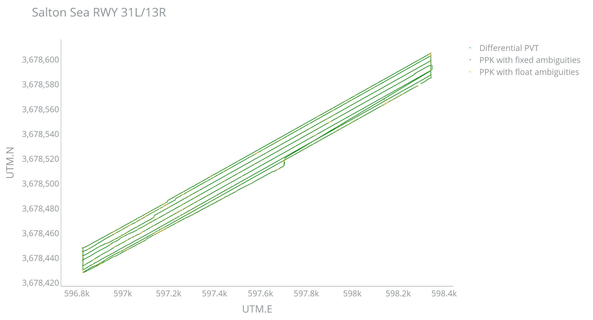

# Repository for analyzing GNSS Data

The purpose of this repository is to provide a set of tools to analyze GNSS data or to extract data from GNSS data in a reusable way. GNSS data can come from different sources, such as:
- GNSS raw data from a GNSS receiver (SBF or u-Blox raw data)
- GNSS data from a GNSS simulator
- GNSS data from NMEA sentences
- GNSS data coming from a RTCM server
- processed GNSS data from software (RTKLib or gLab)

Using classes for each data source and commonly used functions, the GNSS data can be analyzed or used in a way that is reusable.

## Description

The repository contains Python scripts and Python classes for analyzing GNSS data. The repository is organized as follows:
- `sbf`: contains the classes for reading and parsing SBF files
- `rtkpos`: contains the classes for reading and parsing the position and status files obtained by RTKLib processing
- `glab`: contains the classes for reading and parsing GLAB files (*not yet implemented*)

Each of these directories contain a Python class for reading and parsing the data. The classes are designed to be used in a way that is reusable.

Next to these directories there is a `utils` directory which contains utility functions that can be used by Python scripts or the classes. The `gnss` directory contains at present the `geoid` directory which is used to calculate the geoid height $H$ from the ellipsoid height $h$ and the geoid undulation $N$. The `plot` directory contains functions for plotting GNSS data.


The repository contains the following classes:
- `sbf/sbf_class`: class for reading and parsing SBF files
- `rtkpos/rtkpos_class`: class for reading and parsing the position and status files obtained by RTKLib processing
- `glab/glab_class`: class for reading and parsing the GLAB files (*__not yet implemented__*)
- Other classes for reading and parsing data from other sources can be added in a similar fashion.

The main purpose is to create classes which are reusable for different contexts, whether it is for pure analysis, for monitoring purposes or for extracting GNSS data used for EBH calculations.

The design goal is to create Python scripts which follow the Linux principle of **"do one thing and do it well"**. Subsequent scripts can be used to call another script to further enhance the functionality. This is obtained by using the Python idiom `if __name__ == "__main__":`. This construct enables a single Python file to not only support reusable code and functions, but also contain executable code that will not explicitly run when a module is imported.

## Usage of Python logging class
The Python logging class is used to log messages to a file and to the console. The logger methods are named after the level or severity of the events they are used to tracking. The standard levels and their applicability are described below (in increasing order of severity):

| Level    | When it’s used                                                                                                                                                         |
| -------- | ---------------------------------------------------------------------------------------------------------------------------------------------------------------------- |
| DEBUG    | Detailed information, typically of interest only when diagnosing problems.                                                                                             |
| INFO     | Confirmation that things are working as expected.                                                                                                                      |
| WARNING  | An indication that something unexpected happened, or indicative of some problem in the near future (e.g. ‘disk space low’). The software is still working as expected. |
| ERROR    | Due to a more serious problem, the software has not been able to perform some function.                                                                                |
| CRITICAL | A serious error, indicating that the program itself may be unable to continue running.                                                                                 |


 The implemented logger class creates logger objects which are used in the following way:
- the file logger logs all messages equal or higher than `DEBUG` and writes them to a file named `script_name.log` in the `logs` directory in daily files.
- the console logger logs all messages equal or higher defined by the option `--verbose` or `-v`:
  - `-v`: logs all messages equal or higher than `WARNING`
  - `-vv`: logs all messages equal or higher than `INFO`
  - `-vvv`: logs all messages equal or higher than `DEBUG`.


## The `argparse` module

The CLI arguments are parsed using the `argparse` module. The `argparse` module is a standard library module in Python that provides a way to parse command-line arguments. In order to assist the user in finding out which arguments are available, the `argparse` module provides a help message that lists all the available arguments.

```bash
± rtk_pvtgeod.py -h
usage: rtk_pvtgeod.py [-h] [-V] [-v] --sbf_fn SBF_FN

argument_parser.py analysis of SBF data

options:
  -h, --help       show this help message and exit
  -V, --version    show program's version number and exit
  -v, --verbose    verbose level... repeat up to three times.
  --sbf_fn SBF_FN  input SBF filename
```

By importing the `argcomplete` module, the command line arguments can be completed automatically by pressing the tab key after including in the `~/.bashrc` file:

```bash
for file in  rtk_pvtgeod.py ppk_rnx2rtkp.py rtkppk_plot.py ebh_lines.py
do
    complete -o nospace -o default -o bashdefault -F _Python_argcomplete ${file}
done
```

The file `utils/argument_parser.py` contains the function `argument_parser_xyz()` which is used to parse the command line arguments for each Python script. The function `argument_parser_xyz()` is called in the main script and the arguments are passed to the main function. 

## SBF related classes and functions

The `sbf_class` is a class that reads and parses SBF files. The class  has the following fields:
- `sbf_fn`: the SBF filename, mandatory
- `start_time`: the start time of the SBF file, optional
- `end_time`: the end time of the SBF file, optional
- `logger`: the logger object, optional

During initialization of the class, the fields (except `logger`) are validated.

The class has the following methods:
- `def bin2asc_dataframe(self, lst_sbfblocks: list) -> dict:`
    This method converts the SBF data to a dictionary of [polars dataframes](https://docs.pola.rs/)  using the `bin2asc` method. The dictionary contains as keys the SBF block names and as values the [polars dataframes](https://docs.pola.rs/). Its purpose is to convert the SBF data to a dictionary of [polars dataframes](https://docs.pola.rs/) by only parsing ones the SBF file `sbf_fn`. The call to `bin2asc` has always the options "-f", `self.sbf_fn`, "-n", "NaN", "-E", "-r", "-t", "-v" and adds one or several `-m` option followed by the SBF block name.
    
    `bin2asc` is a command line tool that converts binary SBF files to CSV files and is part of the  [Septentrio RxTools](https://www.septentrio.com/en/products/software/rxtools#resources) software.

- `def add_columns(self, block_df: pl.DataFrame) -> pl.DataFrame:`
    Depending on the converted SBF block some additional columns are created for later use. 
    - `"WNc [w]", "TOW [0.001 s]"` are converted to a Python `datetime` object.
    - `"SVID"` is converted to a `"PRN"` string.
      - _Remark: the `"SVID"` field should be an integer but sometimes it is a string which is a bug in the `bin2asc` conversion._
    - `"Latitude [rad]", "Longitude [rad]"` are converted to `"Latitude [deg]"` and `"Longitude [deg]"` and to `"UTM.E", "UTM.N"` using the `utm` module. The geodetic coordinates in radians are subsequently dropped.
    - `"Height [m]", "Undulation [m]"` are combined to `"ortoH [m]"`.

- `def used_columns(self, sbf_block: str) -> list:`
    The `bin2asc` conversion creates CSV files with a lot of information which are not all needed. This method selects the columns used for the subsequent analysis or processing. The columns are selected based on the SBF block name and the `dtype` of the column is set to the [polars](https://docs.pola.rs/) type definition, reducing the memory usage of the SBF block [polars dataframe](https://docs.pola.rs/).
        - _Remark: currently only implemented for the `PVTGeodetic2` SBF block._

In the `sbf` directory the file `sbf_constants.py` contains the constants used for interpreting some of the SBF data fields. 

## RTKPos related classes and functions

A similar setup is used for the `RTKPos` class. The class has the following fields:
- `pos_fn`: the rtklib pos filename, mandatory
- `start_time`: the start time of the SBF file, optional
- `end_time`: the end time of the SBF file, optional
- `logger`: the logger object, optional

    - _Remark: for using the RTKLib created position file with the [polars dataframe](https://docs.pola.rs/) the position file has to be created with the `-s sep :   field separator [' ']` option to obtain a CSV file._

The class has the following methods:
- `def rtkpos_schema(self) -> dict:`
    This method returns a dictionary with the column names and the [polars](https://docs.pola.rs/) dtypes for the columns found in the RTKPos CSV position file, reducing the memory usage of the  [polars dataframe](https://docs.pola.rs/).

- `def info_processing(self) -> Tuple[dict, list]:`
    This method returns a tuple containing:
        - a dictionary with the processing information extracted from the RTKPos CSV position file (cfr extract below)
        - a list containing the column names of the RTKPos CSV position file, by replacing the `"GPST"` column name with `"WNc", "TOW(s)"`.
```bash
% program   : rnx2rtkp ver.demo5 b34g
% inp file  : rnx/ROVR00BEL_R_20241701647_05H_10Z_MO.rnx
% inp file  : rnx/SSEA00XXX_R_20241701639_05H_01S_MO.rnx
% inp file  : rnx/SSEA00XXX_R_20241701620_06H_MN.rnx
% obs start : 2024/06/18 16:47:43.0 GPST (week2319 233263.0s)
% obs end   : 2024/06/18 21:03:43.1 GPST (week2319 248623.1s)
% ref pos   : 33.241210525,-115.951228361,  -66.0251
%
% (lat/lon/height=WGS84/ellipsoidal,Q=1:fix,2:float,3:sbas,4:dgps,5:single,6:ppp,ns=# of satellites)
%  GPST      , latitude(deg),longitude(deg), height(m),  Q, ns,  sdn(m),  sde(m),  sdu(m), sdne(m), sdeu(m), sdun(m),age(s), ratio
```

- `def add_columns(self, df_pos: pl.DataFrame) -> pl.DataFrame:`    
    Similar to the `add_columns` method of the `Sbf` class, but for the RTKPos CSV position file.

## Python scripts with a main function

### The script `rtk_pvtgeod.py`

```bash
± rtk_pvtgeod.py -h
usage: rtk_pvtgeod.py [-h] [-V] [-v] --sbf_fn SBF_FN

argument_parser.py analysis of SBF data

options:
  -h, --help       show this help message and exit
  -V, --version    show program's version number and exit
  -v, --verbose    verbose level... repeat up to three times.
  --sbf_fn SBF_FN  input SBF filename
```
This script reads the SBF file and extracts the PVTGeodetic2 block and writes the data to  [polars dataframe](https://docs.pola.rs/) with selected columns.

```bash
± rtk_pvtgeod.py --sbf_fn ./data/1342172Z.24_ -vv
2024-08-05 14:22:28,510 [INFO](rtk_pvtgeod:init_logger.pylogger_setup:78): ---------- start rtk_pvtgeod -------------
2024-08-05 14:22:28,511 [INFO](rtk_pvtgeod:rtk_pvtgeod.pyrtk_pvtgeod:67): Parsed arguments: Namespace(verbose=2, sbf_fn='./data/1342172Z.24_')
2024-08-05 14:22:28,511 [INFO](rtk_pvtgeod:sbf_class.pyvalidate_file:50): File validated successfully: ./data/1342172Z.24_
self.start_time = None
2024-08-05 14:22:28,511 [INFO](rtk_pvtgeod:sbf_class.pyvalidate_start_time:67): No start time specified.
self.end_time = None
2024-08-05 14:22:28,511 [INFO](rtk_pvtgeod:sbf_class.pyvalidate_end_time:82): No end time specified.
2024-08-05 14:22:28,511 [INFO](rtk_pvtgeod:sbf_class.pybin2asc_dataframe:101): /opt/Septentrio/RxTools/bin/bin2asc conversion of SBF file ./data/1342172Z.24_ to CSV files and importing into dataframes for SBF blocks
PVTGeodetic2
Verbose mode
Display of raw values enabled
Input file: ./data/1342172Z.24_
Assuming default format: SBF
Selected messages: PVTGeodetic2
DoNotUse representation: NaN
Column titles enabled
Messages without valid time are excluded
Processing file ./data/1342172Z.24_
Errors occurred during decoding of data (see output files).                     
Duration: 10.563 seconds.
{'Latitude [rad]': Float64, 'Longitude [rad]': Float64, 'Height [m]': Float64, 'Undulation [m]': Float32, 'COG [°]': Float32, 'TOW [0.001 s]': UInt32, 'SignalInfo': UInt32, 'WNc [w]': UInt16, 'MeanCorrAge [0.01 s]': UInt16, 'Type': UInt8, 'Error': UInt8, 'NrSV': UInt8}
2024-08-05 14:22:39,315 [INFO](rtk_pvtgeod:sbf_class.pyadd_columns:186): 	removing rows with no PVT solution
2024-08-05 14:22:39,318 [INFO](rtk_pvtgeod:sbf_class.pyadd_columns:192): 	adding datetime column to the dataframe
2024-08-05 14:22:39,325 [INFO](rtk_pvtgeod:sbf_class.pyadd_columns:218): 	adding UTM coordinates to the dataframe
2024-08-05 14:22:39,328 [INFO](rtk_pvtgeod:sbf_class.pyadd_columns:267): 	adding orthometric height to the dataframe
2024-08-05 14:22:39,330 [WARNING](rtk_pvtgeod:sbf_class.pyadd_columns:274): 	collecting the dataframe. Be patient.

Analysis of the quality of the position data
2024-08-05 14:22:46,051 [WARNING](rtk_pvtgeod:rtk_pvtgeod.pyquality_analysis:40): ╒═══════════════════════════╤═════════╤══════════════╕
│ PNT Mode                  │   Count │ Percentage   │
╞═══════════════════════════╪═════════╪══════════════╡
│ RTK with fixed ambiguities │  114423 │ 82.50%       │
│ Stand-Alone PVT           │   12522 │ 9.03%        │
│ Differential PVT          │    5945 │ 4.29%        │
│ RTK with float ambiguities │    5809 │ 4.19%        │
╘═══════════════════════════╧═════════╧══════════════╛
shape: (138_699, 16)
┌───────────────┬─────────┬──────┬───────┬────────────┬────────────────┬─────────┬──────┬──────────────────────┬────────────┬─────────────────────────┬────────────────┬─────────────────┬───────────────┬──────────┬────────┐
│ TOW [0.001 s] ┆ WNc [w] ┆ Type ┆ Error ┆ Height [m] ┆ Undulation [m] ┆ COG [°] ┆ NrSV ┆ MeanCorrAge [0.01 s] ┆ SignalInfo ┆ DT                      ┆ latitude [deg] ┆ longitude [deg] ┆ UTM.E         ┆ UTM.N    ┆ orthoH │
│ ---           ┆ ---     ┆ ---  ┆ ---   ┆ ---        ┆ ---            ┆ ---     ┆ ---  ┆ ---                  ┆ ---        ┆ ---                     ┆ ---            ┆ ---             ┆ ---           ┆ ---      ┆ ---    │
│ u32           ┆ u16     ┆ u8   ┆ u8    ┆ f64        ┆ f32            ┆ f32     ┆ u8   ┆ u16                  ┆ u32        ┆ datetime[μs]            ┆ f64            ┆ f64             ┆ f64           ┆ f64      ┆ f64    │
╞═══════════════╪═════════╪══════╪═══════╪════════════╪════════════════╪═════════╪══════╪══════════════════════╪════════════╪═════════════════════════╪════════════════╪═════════════════╪═══════════════╪══════════╪════════╡
│ 397836600     ┆ 2319    ┆ 1    ┆ 0     ┆ 10.806     ┆ -33.362        ┆ null    ┆ 5    ┆ null                 ┆ 131072     ┆ 2024-06-20 14:30:36.600 ┆ 33.147268      ┆ -116.130561     ┆ 581085.395441 ┆ 3.6679e6 ┆ 44.168 │
│ 397836700     ┆ 2319    ┆ 1    ┆ 0     ┆ 10.801     ┆ -33.362        ┆ null    ┆ 5    ┆ null                 ┆ 131072     ┆ 2024-06-20 14:30:36.700 ┆ 33.147268      ┆ -116.130561     ┆ 581085.394853 ┆ 3.6679e6 ┆ 44.163 │
│ 397836800     ┆ 2319    ┆ 1    ┆ 0     ┆ 10.797     ┆ -33.362        ┆ null    ┆ 5    ┆ null                 ┆ 131072     ┆ 2024-06-20 14:30:36.800 ┆ 33.147268      ┆ -116.130561     ┆ 581085.397961 ┆ 3.6679e6 ┆ 44.159 │
│ 397836900     ┆ 2319    ┆ 1    ┆ 0     ┆ 10.802     ┆ -33.362        ┆ null    ┆ 5    ┆ null                 ┆ 131072     ┆ 2024-06-20 14:30:36.900 ┆ 33.147268      ┆ -116.130561     ┆ 581085.399075 ┆ 3.6679e6 ┆ 44.164 │
│ 397837000     ┆ 2319    ┆ 1    ┆ 0     ┆ 10.798     ┆ -33.362        ┆ null    ┆ 5    ┆ null                 ┆ 131072     ┆ 2024-06-20 14:30:37     ┆ 33.147268      ┆ -116.130561     ┆ 581085.398812 ┆ 3.6679e6 ┆ 44.16  │
│ …             ┆ …       ┆ …    ┆ …     ┆ …          ┆ …              ┆ …       ┆ …    ┆ …                    ┆ …          ┆ …                       ┆ …              ┆ …               ┆ …             ┆ …        ┆ …      │
│ 412243600     ┆ 2319    ┆ 1    ┆ 0     ┆ 6.731      ┆ -33.355        ┆ null    ┆ 25   ┆ null                 ┆ 1881300997 ┆ 2024-06-20 18:30:43.600 ┆ 33.153778      ┆ -116.136138     ┆ 580559.374515 ┆ 3.6687e6 ┆ 40.086 │
│ 412243700     ┆ 2319    ┆ 1    ┆ 0     ┆ 6.72       ┆ -33.355        ┆ null    ┆ 25   ┆ null                 ┆ 1881300997 ┆ 2024-06-20 18:30:43.700 ┆ 33.153778      ┆ -116.136138     ┆ 580559.377845 ┆ 3.6687e6 ┆ 40.075 │
│ 412243800     ┆ 2319    ┆ 1    ┆ 0     ┆ 6.71       ┆ -33.355        ┆ null    ┆ 25   ┆ null                 ┆ 1881300997 ┆ 2024-06-20 18:30:43.800 ┆ 33.153778      ┆ -116.136138     ┆ 580559.380503 ┆ 3.6687e6 ┆ 40.065 │
│ 412243900     ┆ 2319    ┆ 1    ┆ 0     ┆ 6.701      ┆ -33.355        ┆ null    ┆ 25   ┆ null                 ┆ 1881300997 ┆ 2024-06-20 18:30:43.900 ┆ 33.153778      ┆ -116.136138     ┆ 580559.383026 ┆ 3.6687e6 ┆ 40.056 │
│ 412244000     ┆ 2319    ┆ 1    ┆ 0     ┆ 6.687      ┆ -33.355        ┆ null    ┆ 25   ┆ null                 ┆ 1881300997 ┆ 2024-06-20 18:30:44     ┆ 33.153778      ┆ -116.136138     ┆ 580559.38578  ┆ 3.6687e6 ┆ 40.042 │
└───────────────┴─────────┴──────┴───────┴────────────┴────────────────┴─────────┴──────┴──────────────────────┴────────────┴─────────────────────────┴────────────────┴─────────────────┴───────────────┴──────────┴────────┘
```

The created polars dataframe is returned and can thus be used by another script which calls this script.

### The script `ppk_rnx2rtkp.py`

```bash
± ppk_rnx2rtkp.py -h
usage: ppk_rnx2rtkp.py [-h] [-V] [-v] --pos_fn POS_FN

argument_parser.py analysis of rnx2rtkp position file

options:
  -h, --help       show this help message and exit
  -V, --version    show program's version number and exit
  -v, --verbose    verbose level... repeat up to three times.
  --pos_fn POS_FN  input rnx2rtkp pos filename
```

This script reads the CSV position file and returns a polar dataframe.

```bash
± ppk_rnx2rtkp.py --pos_fn /home/amuls/GNSSData/USA_CA_2024/SaltonSea/rtkp/ROVR00BEL_R_20241701647_05H_10Z_MO.pos -vv
2024-08-05 14:28:54,744 [INFO](ppk_rnx2rtkp:init_logger.pylogger_setup:78): ---------- start ppk_rnx2rtkp -------------
2024-08-05 14:28:54,744 [INFO](ppk_rnx2rtkp:ppk_rnx2rtkp.pyrtkp_pos:65): Parsed arguments: Namespace(verbose=2, pos_fn='/home/amuls/GNSSData/USA_CA_2024/SaltonSea/rtkp/ROVR00BEL_R_20241701647_05H_10Z_MO.pos')
2024-08-05 14:28:54,744 [INFO](ppk_rnx2rtkp:rtkpos_class.pyvalidate_file:46): File validated successfully: /home/amuls/GNSSData/USA_CA_2024/SaltonSea/rtkp/ROVR00BEL_R_20241701647_05H_10Z_MO.pos
2024-08-05 14:28:54,745 [INFO](ppk_rnx2rtkp:rtkpos_class.pyvalidate_start_time:67): No start time specified.
2024-08-05 14:28:54,745 [INFO](ppk_rnx2rtkp:rtkpos_class.pyvalidate_end_time:86): No end time specified.
2024-08-05 14:28:54,749 [INFO](ppk_rnx2rtkp:rtkpos_class.pyadd_columns:225): 	adding datetime to the dataframe
2024-08-05 14:28:54,752 [INFO](ppk_rnx2rtkp:rtkpos_class.pyadd_columns:237): 	adding UTM coordinates to the dataframe
2024-08-05 14:28:54,753 [INFO](ppk_rnx2rtkp:rtkpos_class.pyadd_columns:276): 	adding geoid undulation & orthometric height to the dataframe
2024-08-05 14:28:54,754 [WARNING](ppk_rnx2rtkp:rtkpos_class.pyadd_columns:298): 	collecting the dataframe. Be patient.

Analysis of the quality of the position data
2024-08-05 14:29:01,383 [WARNING](ppk_rnx2rtkp:ppk_rnx2rtkp.pyquality_analysis:35): ╒═══════════════════════════╤═════════╤══════════════╕
│ PNT Mode                  │   Count │ Percentage   │
╞═══════════════════════════╪═════════╪══════════════╡
│ Differential PVT          │       3 │ 0.00%        │
│ PPK with fixed ambiguities │  141661 │ 98.09%       │
│ PPK with float ambiguities │    2757 │ 1.91%        │
╘═══════════════════════════╧═════════╧══════════════╛
shape: (144_421, 20)
┌──────┬──────────┬───────────────┬────────────────┬───────────┬─────┬─────┬────────┬────────┬────────┬─────────┬─────────┬─────────┬────────┬───────┬─────────────────────────┬───────────────┬──────────┬────────────┬────────────┐
│ WNc  ┆ TOW(s)   ┆ latitude(deg) ┆ longitude(deg) ┆ height(m) ┆ Q   ┆ ns  ┆ sdn(m) ┆ sde(m) ┆ sdu(m) ┆ sdne(m) ┆ sdeu(m) ┆ sdun(m) ┆ age(s) ┆ ratio ┆ DT                      ┆ UTM.E         ┆ UTM.N    ┆ undulation ┆ orthoH     │
│ ---  ┆ ---      ┆ ---           ┆ ---            ┆ ---       ┆ --- ┆ --- ┆ ---    ┆ ---    ┆ ---    ┆ ---     ┆ ---     ┆ ---     ┆ ---    ┆ ---   ┆ ---                     ┆ ---           ┆ ---      ┆ ---        ┆ ---        │
│ i32  ┆ f64      ┆ f64           ┆ f64            ┆ f64       ┆ i16 ┆ i16 ┆ f32    ┆ f32    ┆ f32    ┆ f32     ┆ f32     ┆ f32     ┆ f32    ┆ f32   ┆ datetime[μs]            ┆ f64           ┆ f64      ┆ f64        ┆ f64        │
╞══════╪══════════╪═══════════════╪════════════════╪═══════════╪═════╪═════╪════════╪════════╪════════╪═════════╪═════════╪═════════╪════════╪═══════╪═════════════════════════╪═══════════════╪══════════╪════════════╪════════════╡
│ 2319 ┆ 233263.0 ┆ 33.241161     ┆ -115.95132     ┆ -64.425   ┆ 2   ┆ 4   ┆ 0.7209 ┆ 0.7955 ┆ 0.2946 ┆ 0.7573  ┆ -0.4839 ┆ -0.4607 ┆ 0.0    ┆ 0.0   ┆ 2024-06-18 16:47:43     ┆ 597698.092701 ┆ 3.6785e6 ┆ -34.169563 ┆ -30.255437 │
│ 2319 ┆ 233263.1 ┆ 33.241164     ┆ -115.951317    ┆ -64.5365  ┆ 2   ┆ 4   ┆ 0.6971 ┆ 0.7693 ┆ 0.2849 ┆ 0.7323  ┆ -0.468  ┆ -0.4455 ┆ 0.1    ┆ 0.0   ┆ 2024-06-18 16:47:43.100 ┆ 597698.377292 ┆ 3.6785e6 ┆ -34.16957  ┆ -30.36693  │
│ 2319 ┆ 233263.2 ┆ 33.241166     ┆ -115.951314    ┆ -64.655   ┆ 2   ┆ 4   ┆ 0.6738 ┆ 0.7437 ┆ 0.2754 ┆ 0.7079  ┆ -0.4524 ┆ -0.4306 ┆ 0.2    ┆ 0.0   ┆ 2024-06-18 16:47:43.200 ┆ 597698.681733 ┆ 3.6785e6 ┆ -34.169577 ┆ -30.485423 │
│ 2319 ┆ 233263.3 ┆ 33.24117      ┆ -115.951309    ┆ -64.844   ┆ 2   ┆ 4   ┆ 0.6528 ┆ 0.7206 ┆ 0.2667 ┆ 0.6859  ┆ -0.4383 ┆ -0.4172 ┆ 0.3    ┆ 0.0   ┆ 2024-06-18 16:47:43.300 ┆ 597699.179407 ┆ 3.6785e6 ┆ -34.169588 ┆ -30.674412 │
│ 2319 ┆ 233263.4 ┆ 33.241174     ┆ -115.951304    ┆ -65.0024  ┆ 2   ┆ 4   ┆ 0.6321 ┆ 0.6977 ┆ 0.2582 ┆ 0.664   ┆ -0.4243 ┆ -0.4038 ┆ 0.4    ┆ 0.0   ┆ 2024-06-18 16:47:43.400 ┆ 597699.590065 ┆ 3.6785e6 ┆ -34.169597 ┆ -30.832803 │
│ …    ┆ …        ┆ …             ┆ …              ┆ …         ┆ …   ┆ …   ┆ …      ┆ …      ┆ …      ┆ …       ┆ …       ┆ …       ┆ …      ┆ …     ┆ …                       ┆ …             ┆ …        ┆ …          ┆ …          │
│ 2319 ┆ 248622.7 ┆ 33.241207     ┆ -115.951254    ┆ -67.0951  ┆ 1   ┆ 8   ┆ 0.0037 ┆ 0.0029 ┆ 0.005  ┆ -0.0013 ┆ -0.0019 ┆ -0.0015 ┆ -0.3   ┆ 3.9   ┆ 2024-06-18 21:03:42.700 ┆ 597704.273984 ┆ 3.6785e6 ┆ -34.169702 ┆ -32.925398 │
│ 2319 ┆ 248622.8 ┆ 33.241207     ┆ -115.951254    ┆ -67.0964  ┆ 1   ┆ 8   ┆ 0.0037 ┆ 0.0029 ┆ 0.005  ┆ -0.0013 ┆ -0.0019 ┆ -0.0015 ┆ -0.2   ┆ 3.9   ┆ 2024-06-18 21:03:42.800 ┆ 597704.274067 ┆ 3.6785e6 ┆ -34.169702 ┆ -32.926698 │
│ 2319 ┆ 248622.9 ┆ 33.241207     ┆ -115.951254    ┆ -67.098   ┆ 1   ┆ 8   ┆ 0.0037 ┆ 0.0029 ┆ 0.0049 ┆ -0.0013 ┆ -0.0019 ┆ -0.0015 ┆ -0.1   ┆ 3.9   ┆ 2024-06-18 21:03:42.900 ┆ 597704.274896 ┆ 3.6785e6 ┆ -34.169703 ┆ -32.928297 │
│ 2319 ┆ 248623.0 ┆ 33.241207     ┆ -115.951254    ┆ -67.0985  ┆ 1   ┆ 8   ┆ 0.0037 ┆ 0.0029 ┆ 0.0049 ┆ -0.0013 ┆ -0.0019 ┆ -0.0015 ┆ 0.0    ┆ 4.0   ┆ 2024-06-18 21:03:43     ┆ 597704.275547 ┆ 3.6785e6 ┆ -34.169703 ┆ -32.928797 │
│ 2319 ┆ 248623.1 ┆ 33.241207     ┆ -115.951254    ┆ -67.1     ┆ 1   ┆ 8   ┆ 0.0037 ┆ 0.0029 ┆ 0.0049 ┆ -0.0013 ┆ -0.0019 ┆ -0.0015 ┆ 0.1    ┆ 4.0   ┆ 2024-06-18 21:03:43.100 ┆ 597704.276395 ┆ 3.6785e6 ┆ -34.169703 ┆ -32.930297 │
└──────┴──────────┴───────────────┴────────────────┴───────────┴─────┴─────┴────────┴────────┴────────┴─────────┴─────────┴─────────┴────────┴───────┴─────────────────────────┴───────────────┴──────────┴────────────┴────────────┘
```

### The script `rtkppk_plot.py`

This script plots the data obtained from the polars dataframe created by the script `rtk_pvtgeod.py` or `ppk_rnx2rtkp.py`.

_Remark: currently only implemented for the RTK solution_

The script calls one of the previous scripts to create the polars dataframe, extracts the columns needed for plotting and plots the data.

```bash
± rtkppk_plot.py -h
usage: rtkppk_plot.py [-h] [-V] [-v] --pos_fn POS_FN [--plot]

argument_parser.py analysis of rnx2rtkp position file

options:
  -h, --help       show this help message and exit
  -V, --version    show program's version number and exit
  -v, --verbose    verbose level... repeat up to three times.
  --pos_fn POS_FN  input rnx2rtkp pos filename
  --plot           displays plots (default False)
```

```bash
± rtkppk_plot.py --pos_fn /home/amuls/GNSSData/USA_CA_2024/SaltonSea/rtkp/ROVR00BEL_R_20241701647_05H_10Z_MO.pos -vv --plot
2024-08-05 14:34:30,771 [INFO](rtkppk_plot:init_logger.pylogger_setup:78): ---------- start rtkppk_plot -------------
2024-08-05 14:34:30,772 [INFO](ppk_rnx2rtkp:init_logger.pylogger_setup:78): ---------- start ppk_rnx2rtkp -------------
2024-08-05 14:34:30,772 [INFO](ppk_rnx2rtkp:ppk_rnx2rtkp.pyrtkp_pos:65): Parsed arguments: Namespace(verbose=2, pos_fn='/home/amuls/GNSSData/USA_CA_2024/SaltonSea/rtkp/ROVR00BEL_R_20241701647_05H_10Z_MO.pos')
2024-08-05 14:34:30,772 [INFO](ppk_rnx2rtkp:rtkpos_class.pyvalidate_file:46): File validated successfully: /home/amuls/GNSSData/USA_CA_2024/SaltonSea/rtkp/ROVR00BEL_R_20241701647_05H_10Z_MO.pos
2024-08-05 14:34:30,772 [INFO](ppk_rnx2rtkp:rtkpos_class.pyvalidate_start_time:67): No start time specified.
2024-08-05 14:34:30,772 [INFO](ppk_rnx2rtkp:rtkpos_class.pyvalidate_end_time:86): No end time specified.
2024-08-05 14:34:30,777 [INFO](ppk_rnx2rtkp:rtkpos_class.pyadd_columns:225): 	adding datetime to the dataframe
2024-08-05 14:34:30,780 [INFO](ppk_rnx2rtkp:rtkpos_class.pyadd_columns:237): 	adding UTM coordinates to the dataframe
2024-08-05 14:34:30,781 [INFO](ppk_rnx2rtkp:rtkpos_class.pyadd_columns:276): 	adding geoid undulation & orthometric height to the dataframe
2024-08-05 14:34:30,782 [WARNING](ppk_rnx2rtkp:rtkpos_class.pyadd_columns:298): 	collecting the dataframe. Be patient.

Analysis of the quality of the position data
2024-08-05 14:34:37,218 [WARNING](ppk_rnx2rtkp:ppk_rnx2rtkp.pyquality_analysis:35): ╒═══════════════════════════╤═════════╤══════════════╕
│ PNT Mode                  │   Count │ Percentage   │
╞═══════════════════════════╪═════════╪══════════════╡
│ Differential PVT          │       3 │ 0.00%        │
│ PPK with fixed ambiguities │  141661 │ 98.09%       │
│ PPK with float ambiguities │    2757 │ 1.91%        │
╘═══════════════════════════╧═════════╧══════════════╛
from rtkpos_plot df_pos = 
shape: (144_421, 20)
┌──────┬──────────┬───────────────┬────────────────┬───────────┬─────┬─────┬────────┬────────┬────────┬─────────┬─────────┬─────────┬────────┬───────┬─────────────────────────┬───────────────┬──────────┬────────────┬────────────┐
│ WNc  ┆ TOW(s)   ┆ latitude(deg) ┆ longitude(deg) ┆ height(m) ┆ Q   ┆ ns  ┆ sdn(m) ┆ sde(m) ┆ sdu(m) ┆ sdne(m) ┆ sdeu(m) ┆ sdun(m) ┆ age(s) ┆ ratio ┆ DT                      ┆ UTM.E         ┆ UTM.N    ┆ undulation ┆ orthoH     │
│ ---  ┆ ---      ┆ ---           ┆ ---            ┆ ---       ┆ --- ┆ --- ┆ ---    ┆ ---    ┆ ---    ┆ ---     ┆ ---     ┆ ---     ┆ ---    ┆ ---   ┆ ---                     ┆ ---           ┆ ---      ┆ ---        ┆ ---        │
│ i32  ┆ f64      ┆ f64           ┆ f64            ┆ f64       ┆ i16 ┆ i16 ┆ f32    ┆ f32    ┆ f32    ┆ f32     ┆ f32     ┆ f32     ┆ f32    ┆ f32   ┆ datetime[μs]            ┆ f64           ┆ f64      ┆ f64        ┆ f64        │
╞══════╪══════════╪═══════════════╪════════════════╪═══════════╪═════╪═════╪════════╪════════╪════════╪═════════╪═════════╪═════════╪════════╪═══════╪═════════════════════════╪═══════════════╪══════════╪════════════╪════════════╡
│ 2319 ┆ 233263.0 ┆ 33.241161     ┆ -115.95132     ┆ -64.425   ┆ 2   ┆ 4   ┆ 0.7209 ┆ 0.7955 ┆ 0.2946 ┆ 0.7573  ┆ -0.4839 ┆ -0.4607 ┆ 0.0    ┆ 0.0   ┆ 2024-06-18 16:47:43     ┆ 597698.092701 ┆ 3.6785e6 ┆ -34.169563 ┆ -30.255437 │
│ 2319 ┆ 233263.1 ┆ 33.241164     ┆ -115.951317    ┆ -64.5365  ┆ 2   ┆ 4   ┆ 0.6971 ┆ 0.7693 ┆ 0.2849 ┆ 0.7323  ┆ -0.468  ┆ -0.4455 ┆ 0.1    ┆ 0.0   ┆ 2024-06-18 16:47:43.100 ┆ 597698.377292 ┆ 3.6785e6 ┆ -34.16957  ┆ -30.36693  │
│ 2319 ┆ 233263.2 ┆ 33.241166     ┆ -115.951314    ┆ -64.655   ┆ 2   ┆ 4   ┆ 0.6738 ┆ 0.7437 ┆ 0.2754 ┆ 0.7079  ┆ -0.4524 ┆ -0.4306 ┆ 0.2    ┆ 0.0   ┆ 2024-06-18 16:47:43.200 ┆ 597698.681733 ┆ 3.6785e6 ┆ -34.169577 ┆ -30.485423 │
│ 2319 ┆ 233263.3 ┆ 33.24117      ┆ -115.951309    ┆ -64.844   ┆ 2   ┆ 4   ┆ 0.6528 ┆ 0.7206 ┆ 0.2667 ┆ 0.6859  ┆ -0.4383 ┆ -0.4172 ┆ 0.3    ┆ 0.0   ┆ 2024-06-18 16:47:43.300 ┆ 597699.179407 ┆ 3.6785e6 ┆ -34.169588 ┆ -30.674412 │
│ 2319 ┆ 233263.4 ┆ 33.241174     ┆ -115.951304    ┆ -65.0024  ┆ 2   ┆ 4   ┆ 0.6321 ┆ 0.6977 ┆ 0.2582 ┆ 0.664   ┆ -0.4243 ┆ -0.4038 ┆ 0.4    ┆ 0.0   ┆ 2024-06-18 16:47:43.400 ┆ 597699.590065 ┆ 3.6785e6 ┆ -34.169597 ┆ -30.832803 │
│ …    ┆ …        ┆ …             ┆ …              ┆ …         ┆ …   ┆ …   ┆ …      ┆ …      ┆ …      ┆ …       ┆ …       ┆ …       ┆ …      ┆ …     ┆ …                       ┆ …             ┆ …        ┆ …          ┆ …          │
│ 2319 ┆ 248622.7 ┆ 33.241207     ┆ -115.951254    ┆ -67.0951  ┆ 1   ┆ 8   ┆ 0.0037 ┆ 0.0029 ┆ 0.005  ┆ -0.0013 ┆ -0.0019 ┆ -0.0015 ┆ -0.3   ┆ 3.9   ┆ 2024-06-18 21:03:42.700 ┆ 597704.273984 ┆ 3.6785e6 ┆ -34.169702 ┆ -32.925398 │
│ 2319 ┆ 248622.8 ┆ 33.241207     ┆ -115.951254    ┆ -67.0964  ┆ 1   ┆ 8   ┆ 0.0037 ┆ 0.0029 ┆ 0.005  ┆ -0.0013 ┆ -0.0019 ┆ -0.0015 ┆ -0.2   ┆ 3.9   ┆ 2024-06-18 21:03:42.800 ┆ 597704.274067 ┆ 3.6785e6 ┆ -34.169702 ┆ -32.926698 │
│ 2319 ┆ 248622.9 ┆ 33.241207     ┆ -115.951254    ┆ -67.098   ┆ 1   ┆ 8   ┆ 0.0037 ┆ 0.0029 ┆ 0.0049 ┆ -0.0013 ┆ -0.0019 ┆ -0.0015 ┆ -0.1   ┆ 3.9   ┆ 2024-06-18 21:03:42.900 ┆ 597704.274896 ┆ 3.6785e6 ┆ -34.169703 ┆ -32.928297 │
│ 2319 ┆ 248623.0 ┆ 33.241207     ┆ -115.951254    ┆ -67.0985  ┆ 1   ┆ 8   ┆ 0.0037 ┆ 0.0029 ┆ 0.0049 ┆ -0.0013 ┆ -0.0019 ┆ -0.0015 ┆ 0.0    ┆ 4.0   ┆ 2024-06-18 21:03:43     ┆ 597704.275547 ┆ 3.6785e6 ┆ -34.169703 ┆ -32.928797 │
│ 2319 ┆ 248623.1 ┆ 33.241207     ┆ -115.951254    ┆ -67.1     ┆ 1   ┆ 8   ┆ 0.0037 ┆ 0.0029 ┆ 0.0049 ┆ -0.0013 ┆ -0.0019 ┆ -0.0015 ┆ 0.1    ┆ 4.0   ┆ 2024-06-18 21:03:43.100 ┆ 597704.276395 ┆ 3.6785e6 ┆ -34.169703 ┆ -32.930297 │
└──────┴──────────┴───────────────┴────────────────┴───────────┴─────┴─────┴────────┴────────┴────────┴─────────┴─────────┴─────────┴────────┴───────┴─────────────────────────┴───────────────┴──────────┴────────────┴────────────┘
utm_df = 
shape: (144_421, 6)
┌─────────────────────────┬─────┬─────┬───────────────┬──────────┬────────────┐
│ DT                      ┆ Q   ┆ ns  ┆ UTM.E         ┆ UTM.N    ┆ orthoH     │
│ ---                     ┆ --- ┆ --- ┆ ---           ┆ ---      ┆ ---        │
│ datetime[μs]            ┆ i16 ┆ i16 ┆ f64           ┆ f64      ┆ f64        │
╞═════════════════════════╪═════╪═════╪═══════════════╪══════════╪════════════╡
│ 2024-06-18 16:47:43     ┆ 2   ┆ 4   ┆ 597698.092701 ┆ 3.6785e6 ┆ -30.255437 │
│ 2024-06-18 16:47:43.100 ┆ 2   ┆ 4   ┆ 597698.377292 ┆ 3.6785e6 ┆ -30.36693  │
│ 2024-06-18 16:47:43.200 ┆ 2   ┆ 4   ┆ 597698.681733 ┆ 3.6785e6 ┆ -30.485423 │
│ 2024-06-18 16:47:43.300 ┆ 2   ┆ 4   ┆ 597699.179407 ┆ 3.6785e6 ┆ -30.674412 │
│ 2024-06-18 16:47:43.400 ┆ 2   ┆ 4   ┆ 597699.590065 ┆ 3.6785e6 ┆ -30.832803 │
│ …                       ┆ …   ┆ …   ┆ …             ┆ …        ┆ …          │
│ 2024-06-18 21:03:42.700 ┆ 1   ┆ 8   ┆ 597704.273984 ┆ 3.6785e6 ┆ -32.925398 │
│ 2024-06-18 21:03:42.800 ┆ 1   ┆ 8   ┆ 597704.274067 ┆ 3.6785e6 ┆ -32.926698 │
│ 2024-06-18 21:03:42.900 ┆ 1   ┆ 8   ┆ 597704.274896 ┆ 3.6785e6 ┆ -32.928297 │
│ 2024-06-18 21:03:43     ┆ 1   ┆ 8   ┆ 597704.275547 ┆ 3.6785e6 ┆ -32.928797 │
│ 2024-06-18 21:03:43.100 ┆ 1   ┆ 8   ┆ 597704.276395 ┆ 3.6785e6 ┆ -32.930297 │
└─────────────────────────┴─────┴─────┴───────────────┴──────────┴────────────┘
```



### The script `ebh_lines.py`

```bash
± ebh_lines.py -h
usage: ebh_lines.py [-h] [-V] [-v] (--rtk | --ppk) --desc DESC --ebh_fn EBH_FN --timing_fn TIMING_FN [--plot]

argument_parser.py extracts the EBH lines from RTK or PPK created dataframe

options:
  -h, --help            show this help message and exit
  -V, --version         show program's version number and exit
  -v, --verbose         verbose level... repeat up to three times.
  --rtk                 extract lines from RTK solution
  --ppk                 extract lines from PPK solution
  --desc DESC           description of EBH lines project
  --ebh_fn EBH_FN       input RTK/PPK filename
  --timing_fn TIMING_FN
                        input ebh lines timing filename
```

Using the created polars dataframes in RTK or PPK mode, the script `ebh_lines.py` extracts the EBH lines from the RTK or PPK created dataframe based on timing information provided.

```bash
± ebh_lines.py --ppk --ebh_fn /home/amuls/GNSSData/USA_CA_2024/SaltonSea/rtkp/ROVR00BEL_R_20241701647_05H_10Z_MO.pos --timing_fn /home/amuls/GNSSData/USA_CA_2024/SaltonSea/salton_timings.txt --desc salton_sea -vv
2024-08-05 14:40:55,472 [INFO](ebh_lines:init_logger.pylogger_setup:78): ---------- start ebh_lines -------------
2024-08-05 14:40:55,472 [INFO](ebh_lines:ebh_lines.pyebh_lines:302): Parsed arguments: Namespace(verbose=2, rtk=False, ppk=True, desc='salton_sea', ebh_fn='/home/amuls/GNSSData/USA_CA_2024/SaltonSea/rtkp/ROVR00BEL_R_20241701647_05H_10Z_MO.pos', timing_fn='/home/amuls/GNSSData/USA_CA_2024/SaltonSea/salton_timings.txt', plot=False)
2024-08-05 14:40:55,472 [INFO](ebh_lines:ebh_lines.pyget_ppk_dataframe:44): ppk_rnx2rtkp_args = ['ppk_rnx2rtkp.py', '--pos_fn', '/home/amuls/GNSSData/USA_CA_2024/SaltonSea/rtkp/ROVR00BEL_R_20241701647_05H_10Z_MO.pos', '-vv']
2024-08-05 14:40:55,473 [INFO](ppk_rnx2rtkp:init_logger.pylogger_setup:78): ---------- start ppk_rnx2rtkp -------------
2024-08-05 14:40:55,473 [INFO](ppk_rnx2rtkp:ppk_rnx2rtkp.pyrtkp_pos:65): Parsed arguments: Namespace(verbose=2, pos_fn='/home/amuls/GNSSData/USA_CA_2024/SaltonSea/rtkp/ROVR00BEL_R_20241701647_05H_10Z_MO.pos')
2024-08-05 14:40:55,473 [INFO](ppk_rnx2rtkp:rtkpos_class.pyvalidate_file:46): File validated successfully: /home/amuls/GNSSData/USA_CA_2024/SaltonSea/rtkp/ROVR00BEL_R_20241701647_05H_10Z_MO.pos
2024-08-05 14:40:55,473 [INFO](ppk_rnx2rtkp:rtkpos_class.pyvalidate_start_time:67): No start time specified.
2024-08-05 14:40:55,473 [INFO](ppk_rnx2rtkp:rtkpos_class.pyvalidate_end_time:86): No end time specified.
2024-08-05 14:40:55,478 [INFO](ppk_rnx2rtkp:rtkpos_class.pyadd_columns:225): 	adding datetime to the dataframe
2024-08-05 14:40:55,482 [INFO](ppk_rnx2rtkp:rtkpos_class.pyadd_columns:237): 	adding UTM coordinates to the dataframe
2024-08-05 14:40:55,483 [INFO](ppk_rnx2rtkp:rtkpos_class.pyadd_columns:276): 	adding geoid undulation & orthometric height to the dataframe
2024-08-05 14:40:55,484 [WARNING](ppk_rnx2rtkp:rtkpos_class.pyadd_columns:298): 	collecting the dataframe. Be patient.

Analysis of the quality of the position data
2024-08-05 14:41:02,185 [WARNING](ppk_rnx2rtkp:ppk_rnx2rtkp.pyquality_analysis:35): ╒═══════════════════════════╤═════════╤══════════════╕
│ PNT Mode                  │   Count │ Percentage   │
╞═══════════════════════════╪═════════╪══════════════╡
│ PPK with fixed ambiguities │  141661 │ 98.09%       │
│ Differential PVT          │       3 │ 0.00%        │
│ PPK with float ambiguities │    2757 │ 1.91%        │
╘═══════════════════════════╧═════════╧══════════════╛
2024-08-05 14:41:02,186 [INFO](ebh_lines:ebh_lines.pyebh_lines:311): Dataframe obtained from PPK processing of /home/amuls/GNSSData/USA_CA_2024/SaltonSea/rtkp/ROVR00BEL_R_20241701647_05H_10Z_MO.pos
Dataframe obtained from PPK processing of /home/amuls/GNSSData/USA_CA_2024/SaltonSea/rtkp/ROVR00BEL_R_20241701647_05H_10Z_MO.pos
2024-08-05 14:41:02,186 [INFO](ebh_lines:ebh_lines.pyebh_lines:341): shape: (144_421, 6)
┌─────────────────────────┬─────┬─────┬───────────────┬──────────┬────────────┐
│ DT                      ┆ Q   ┆ ns  ┆ UTM.E         ┆ UTM.N    ┆ orthoH     │
│ ---                     ┆ --- ┆ --- ┆ ---           ┆ ---      ┆ ---        │
│ datetime[μs]            ┆ i16 ┆ i16 ┆ f64           ┆ f64      ┆ f64        │
╞═════════════════════════╪═════╪═════╪═══════════════╪══════════╪════════════╡
│ 2024-06-18 16:47:43     ┆ 2   ┆ 4   ┆ 597698.092701 ┆ 3.6785e6 ┆ -30.255437 │
│ 2024-06-18 16:47:43.100 ┆ 2   ┆ 4   ┆ 597698.377292 ┆ 3.6785e6 ┆ -30.36693  │
│ 2024-06-18 16:47:43.200 ┆ 2   ┆ 4   ┆ 597698.681733 ┆ 3.6785e6 ┆ -30.485423 │
│ 2024-06-18 16:47:43.300 ┆ 2   ┆ 4   ┆ 597699.179407 ┆ 3.6785e6 ┆ -30.674412 │
│ 2024-06-18 16:47:43.400 ┆ 2   ┆ 4   ┆ 597699.590065 ┆ 3.6785e6 ┆ -30.832803 │
│ …                       ┆ …   ┆ …   ┆ …             ┆ …        ┆ …          │
│ 2024-06-18 21:03:42.700 ┆ 1   ┆ 8   ┆ 597704.273984 ┆ 3.6785e6 ┆ -32.925398 │
│ 2024-06-18 21:03:42.800 ┆ 1   ┆ 8   ┆ 597704.274067 ┆ 3.6785e6 ┆ -32.926698 │
│ 2024-06-18 21:03:42.900 ┆ 1   ┆ 8   ┆ 597704.274896 ┆ 3.6785e6 ┆ -32.928297 │
│ 2024-06-18 21:03:43     ┆ 1   ┆ 8   ┆ 597704.275547 ┆ 3.6785e6 ┆ -32.928797 │
│ 2024-06-18 21:03:43.100 ┆ 1   ┆ 8   ┆ 597704.276395 ┆ 3.6785e6 ┆ -32.930297 │
└─────────────────────────┴─────┴─────┴───────────────┴──────────┴────────────┘
shape: (144_421, 6)
┌─────────────────────────┬─────┬─────┬───────────────┬──────────┬────────────┐
│ DT                      ┆ Q   ┆ ns  ┆ UTM.E         ┆ UTM.N    ┆ orthoH     │
│ ---                     ┆ --- ┆ --- ┆ ---           ┆ ---      ┆ ---        │
│ datetime[μs]            ┆ i16 ┆ i16 ┆ f64           ┆ f64      ┆ f64        │
╞═════════════════════════╪═════╪═════╪═══════════════╪══════════╪════════════╡
│ 2024-06-18 16:47:43     ┆ 2   ┆ 4   ┆ 597698.092701 ┆ 3.6785e6 ┆ -30.255437 │
│ 2024-06-18 16:47:43.100 ┆ 2   ┆ 4   ┆ 597698.377292 ┆ 3.6785e6 ┆ -30.36693  │
│ 2024-06-18 16:47:43.200 ┆ 2   ┆ 4   ┆ 597698.681733 ┆ 3.6785e6 ┆ -30.485423 │
│ 2024-06-18 16:47:43.300 ┆ 2   ┆ 4   ┆ 597699.179407 ┆ 3.6785e6 ┆ -30.674412 │
│ 2024-06-18 16:47:43.400 ┆ 2   ┆ 4   ┆ 597699.590065 ┆ 3.6785e6 ┆ -30.832803 │
│ …                       ┆ …   ┆ …   ┆ …             ┆ …        ┆ …          │
│ 2024-06-18 21:03:42.700 ┆ 1   ┆ 8   ┆ 597704.273984 ┆ 3.6785e6 ┆ -32.925398 │
│ 2024-06-18 21:03:42.800 ┆ 1   ┆ 8   ┆ 597704.274067 ┆ 3.6785e6 ┆ -32.926698 │
│ 2024-06-18 21:03:42.900 ┆ 1   ┆ 8   ┆ 597704.274896 ┆ 3.6785e6 ┆ -32.928297 │
│ 2024-06-18 21:03:43     ┆ 1   ┆ 8   ┆ 597704.275547 ┆ 3.6785e6 ┆ -32.928797 │
│ 2024-06-18 21:03:43.100 ┆ 1   ┆ 8   ┆ 597704.276395 ┆ 3.6785e6 ┆ -32.930297 │
└─────────────────────────┴─────┴─────┴───────────────┴──────────┴────────────┘
2024-08-05 14:41:02,196 [INFO](ebh_lines:ebh_lines.pyread_ebh_line_timings:124): ╒════════════╤══════════════════════════════════════════════════════════════════════════════════════════════════════════╕
│ EBH Line   │ EBH Timings                                                                                              │
╞════════════╪══════════════════════════════════════════════════════════════════════════════════════════════════════════╡
│ CL         │ [datetime.datetime(2024, 6, 18, 17, 24, 47, 500000), datetime.datetime(2024, 6, 18, 17, 50, 52, 600000)] │
│ L+4        │ [datetime.datetime(2024, 6, 18, 17, 51, 3, 600000), datetime.datetime(2024, 6, 18, 18, 16, 57, 900000)]  │
│ L-4        │ [datetime.datetime(2024, 6, 18, 18, 17, 12, 300000), datetime.datetime(2024, 6, 18, 18, 43, 19, 100000)] │
│ L+8        │ [datetime.datetime(2024, 6, 18, 18, 43, 36, 300000), datetime.datetime(2024, 6, 18, 19, 9, 28)]          │
│ L-8        │ [datetime.datetime(2024, 6, 18, 19, 9, 49), datetime.datetime(2024, 6, 18, 19, 35, 52, 500000)]          │
│ L+10       │ [datetime.datetime(2024, 6, 18, 19, 36, 17, 600000), datetime.datetime(2024, 6, 18, 20, 2, 9, 800000)]   │
│ L-10       │ [datetime.datetime(2024, 6, 18, 20, 2, 38, 200000), datetime.datetime(2024, 6, 18, 20, 48, 3, 200000)]   │
╘════════════╧══════════════════════════════════════════════════════════════════════════════════════════════════════════╛
2024-08-05 14:41:02,203 [INFO](ebh_lines:ebh_lines.pyebh_lines:350): CL       : 2024/06/18 17:24:47 - 2024/06/18 17:50:52 |  -95.9
2024-08-05 14:41:02,204 [INFO](ebh_lines:ebh_lines.pyebh_lines:350): L+4      : 2024/06/18 17:51:03 - 2024/06/18 18:16:57 |   84.1
2024-08-05 14:41:02,204 [INFO](ebh_lines:ebh_lines.pyebh_lines:350): L-4      : 2024/06/18 18:17:12 - 2024/06/18 18:43:19 |  -95.9
2024-08-05 14:41:02,204 [INFO](ebh_lines:ebh_lines.pyebh_lines:350): L+8      : 2024/06/18 18:43:36 - 2024/06/18 19:09:28 |   84.1
2024-08-05 14:41:02,204 [INFO](ebh_lines:ebh_lines.pyebh_lines:350): L-8      : 2024/06/18 19:09:49 - 2024/06/18 19:35:52 |  -95.9
2024-08-05 14:41:02,204 [INFO](ebh_lines:ebh_lines.pyebh_lines:350): L+10     : 2024/06/18 19:36:17 - 2024/06/18 20:02:09 |   84.1
2024-08-05 14:41:02,204 [INFO](ebh_lines:ebh_lines.pyebh_lines:350): L-10     : 2024/06/18 20:02:38 - 2024/06/18 20:48:03 |  -95.9
2024-08-05 14:41:02,325 [INFO](ebh_lines:ebh_lines.pyebh_lines:364): Writing CSV assurtool file for CL to salton_sea_CL.csv
shape: (3_018, 3)
┌───────────────┬──────────┬────────────┐
│ UTM.E         ┆ UTM.N    ┆ orthoH     │
│ ---           ┆ ---      ┆ ---        │
│ f64           ┆ f64      ┆ f64        │
╞═══════════════╪══════════╪════════════╡
│ 598342.379212 ┆ 3.6786e6 ┆ -38.822464 │
│ 598341.862121 ┆ 3.6786e6 ┆ -38.800377 │
│ 598341.315612 ┆ 3.6786e6 ┆ -38.77819  │
│ 598340.861908 ┆ 3.6786e6 ┆ -38.771801 │
│ 598340.343613 ┆ 3.6786e6 ┆ -38.764014 │
│ …             ┆ …        ┆ …          │
│ 596824.307531 ┆ 3.6784e6 ┆ -25.88892  │
│ 596824.316694 ┆ 3.6784e6 ┆ -25.88742  │
│ 596824.332462 ┆ 3.6784e6 ┆ -25.88632  │
│ 596824.355554 ┆ 3.6784e6 ┆ -25.885019 │
│ 596824.380941 ┆ 3.6784e6 ┆ -25.884418 │
└───────────────┴──────────┴────────────┘
2024-08-05 14:41:02,326 [INFO](ebh_lines:ebh_lines.pyebh_lines:364): Writing CSV assurtool file for L+4 to salton_sea_L+4.csv
shape: (3_037, 3)
┌───────────────┬──────────┬────────────┐
│ UTM.E         ┆ UTM.N    ┆ orthoH     │
│ ---           ┆ ---      ┆ ---        │
│ f64           ┆ f64      ┆ f64        │
╞═══════════════╪══════════╪════════════╡
│ 598344.053805 ┆ 3.6786e6 ┆ -38.954431 │
│ 598344.032138 ┆ 3.6786e6 ┆ -38.955232 │
│ 598343.50315  ┆ 3.6786e6 ┆ -38.957145 │
│ 598343.026289 ┆ 3.6786e6 ┆ -38.874356 │
│ 598342.526608 ┆ 3.6786e6 ┆ -38.840469 │
│ …             ┆ …        ┆ …          │
│ 596825.642656 ┆ 3.6784e6 ┆ -25.906399 │
│ 596825.100252 ┆ 3.6784e6 ┆ -25.913013 │
│ 596824.611932 ┆ 3.6784e6 ┆ -25.926125 │
│ 596824.158559 ┆ 3.6784e6 ┆ -25.926336 │
│ 596823.952149 ┆ 3.6784e6 ┆ -25.913642 │
└───────────────┴──────────┴────────────┘
```

### The script `get_ebh_timings.py`

```bash
± get_ebh_timings.py -h
usage: get_ebh_timings.py [-h] [-V] [-v] --sbf_ifn SBF_IFN [--timing_ofn TIMING_OFN] [--archive ARCHIVE]

options:
  -h, --help            show this help message and exit
  -V, --version         show program's version number and exit
  -v, --verbose         verbose level... repeat up to three times.
  --sbf_ifn SBF_IFN     input SBF filename
  --timing_ofn TIMING_OFN
                        output timing filename
  --archive ARCHIVE     Specify archive's directory name
```

This script extracts EBH timing information from SBF comment blocks and formats them for use in EBH line calculations. It outputs timing information in a format compatible with `ebh_lines.py`.

Key functions:
- `get_SBFcomments(parsed_args, logger)`: Extracts SBF comment blocks from SBF file using the SBF class
- `parseSBFComments(df_sbfComments, logger)`: Processes comment blocks to extract EBH timestamps and converts them to GPS week and TOW format
- `reformat_ebh_timestamps(df_ebh_timestamps, logger)`: Reformats timestamps into a format compatible with ebh_lines.py
- `ebh_timings_to_file(ebh_timings, dest_path, logger)`: Writes formatted timestamps to output file


### The script `get_base_coord.py`

```bash
± get_base_coord.py -h
usage: get_base_coord.py [-h] [-V] [-v] --sbf_ifn SBF_IFN [--datetime DATETIME] [--log_dest LOG_DEST]

options:
  -h, --help            show this help message and exit
  -V, --version         show program's version number and exit
  -v, --verbose         verbose level... repeat up to three times.
  --sbf_ifn SBF_IFN     input SBF filename
  --datetime DATETIME   datetime of base station coordinates [YYYY-MM-DD_HH:MM:SS.s]
  --log_dest LOG_DEST   directory for logging output
```

This script extracts base station coordinates from the BaseStation1 SBF block, which contains the coordinates of the base station used for differential corrections.

Key functions:
- `get_base_coord_from_sbf(parsed_args, logger)`: Main function that:
  - Creates SBF object from input file
  - Extracts BaseStation1 block
  - Retrieves base coordinates at specified datetime
  - Returns coordinates as tuple (X, Y, Z)


### The script `launch_ebh_process.py`

```bash
± launch_ebh_process.py -h
usage: launch_ebh_process.py [-h] [-V] [-v] --sbf_ifn SBF_IFN --base_corr BASE_CORR --conf CONF --desc DESC [--log_dest LOG_DEST]

options:
  -h, --help            show this help message and exit
  -V, --version         show program's version number and exit
  -v, --verbose         verbose level... repeat up to three times.
  --sbf_ifn SBF_IFN     input SBF filename
  --base_corr BASE_CORR base station corrections (RTCM or RINEX)
  --conf CONF           PPK configuration file
  --desc DESC          description of EBH lines project
  --log_dest LOG_DEST   directory for logging output
```

This script serves as a main launcher for the EBH processing workflow. It:
1. Extracts EBH timings from SBF files
2. Analyzes RTK solution quality
3. Decides whether to use RTK or PPK solution based on quality metrics
4. Launches PPK processing if needed
5. Creates ASSUR-formatted output files for each EBH line

The script implements a quality-based decision system:
- If RTK quality is sufficient (>99% fixed solutions), it uses RTK results
- For single line failures, it calculates PPK only for the failed line
- For multiple line failures, it recalculates all lines using PPK

Key functions:
- `ebh_process_launcher(parsed_args, logger)`: Main orchestrator function that coordinates the entire EBH workflow
- `rtk_ppk_qual_check(qual_analysis, RTK_mode, rejection_level, logger)`: Analyzes solution quality and determines processing strategy
- `do_ppk_by_decision(rejected_rtk_lines, rtk_qual_decision, ebh_timings, parsed_args, logger)`: Handles PPK processing based on quality analysis
- `get_rnx_files(parsed_args, logger)`: Creates RINEX observation and navigation files from SBF data


### The script `launch_rnx2rtkp.py`

```bash
± launch_rnx2rtkp.py -h
usage: launch_rnx2rtkp.py [-h] [-V] [-v] --obs OBS --nav NAV --base_corr BASE_CORR --base_coord_X BASE_COORD_X --base_coord_Y BASE_COORD_Y --base_coord_Z BASE_COORD_Z --rnx2rtkp_config_fn RNX2RTKP_CONFIG_FN [--datetime_start DATETIME_START] [--datetime_end DATETIME_END] [--pos_ofn POS_OFN] [--log_dest LOG_DEST]

argument_parser.py launches rnx2rtkp for PPK processing

options:
  -h, --help            show this help message and exit
  -V, --version         show program's version number and exit
  -v, --verbose         verbose level... repeat up to three times.
  --obs OBS            RINEX observation file
  --nav NAV            RINEX navigation file
  --base_corr BASE_CORR
                       base correction file (RTCM3 or RNX obs)
  --base_coord_X BASE_COORD_X
                       base station X coordinate
  --base_coord_Y BASE_COORD_Y
                       base station Y coordinate
  --base_coord_Z BASE_COORD_Z
                       base station Z coordinate
  --rnx2rtkp_config_fn RNX2RTKP_CONFIG_FN
                       rnx2rtkp configuration file
  --datetime_start DATETIME_START
                       start time of calculation [YYYY-MM-DD_HH:MM:SS.f]
  --datetime_end DATETIME_END
                       end time of calculation [YYYY-MM-DD_HH:MM:SS.f]
  --pos_ofn POS_OFN   output filename for PPK solution
  --log_dest LOG_DEST  directory for logging output
  ```

This script automates the execution of RTKLIB's rnx2rtkp program for post-processing kinematic (PPK) GNSS data. It processes RINEX observation and navigation files along with base station corrections to generate precise positioning solutions.

The script has the following key functions:

- `rnx2rtkp_ppk(parsed_args, logger)`: Main function that:
  - Validates input files and parameters
  - Configures output filename based on input parameters
  - Constructs and executes rnx2rtkp command with appropriate options
  - Returns the path to the generated position solution file
- `create_rnx2rtkp_args(parsed_args)`: Builds command line arguments for rnx2rtkp
- `check_base_coord(parsed_args)`: Validates base station coordinates


__Example usage__

```bash
launch_rnx2rtkp.py --obs rover.rnx --nav base.nav --base_corr base.rnx \
--base_coord_X 4023741.2365 --base_coord_Y 309110.4418 --base_coord_Z 4922723.1945 \
--rnx2rtkp_config_fn ppk.conf --datetime_start 2024-01-17_16:47:43 \
--datetime_end 2024-01-17_21:03:43 -vv
```


## Roadmap
If you have ideas for releases in the future, it is a good idea to list them in the README.

## Contributing
State if you are open to contributions and what your requirements are for accepting them.

For people who want to make changes to your project, it's helpful to have some documentation on how to get started. Perhaps there is a script that they should run or some environment variables that they need to set. Make these steps explicit. These instructions could also be useful to your future self.

You can also document commands to lint the code or run tests. These steps help to ensure high code quality and reduce the likelihood that the changes inadvertently break something. Having instructions for running tests is especially helpful if it requires external setup, such as starting a Selenium server for testing in a browser.

## Authors and acknowledgment

- Alain MULS
- Pieterjan DE MEULEMEESTER 
## License
For open source projects, say how it is licensed.

## Project status
If you have run out of energy or time for your project, put a note at the top of the README saying that development has slowed down or stopped completely. Someone may choose to fork your project or volunteer to step in as a maintainer or owner, allowing your project to keep going. You can also make an explicit request for maintainers.
