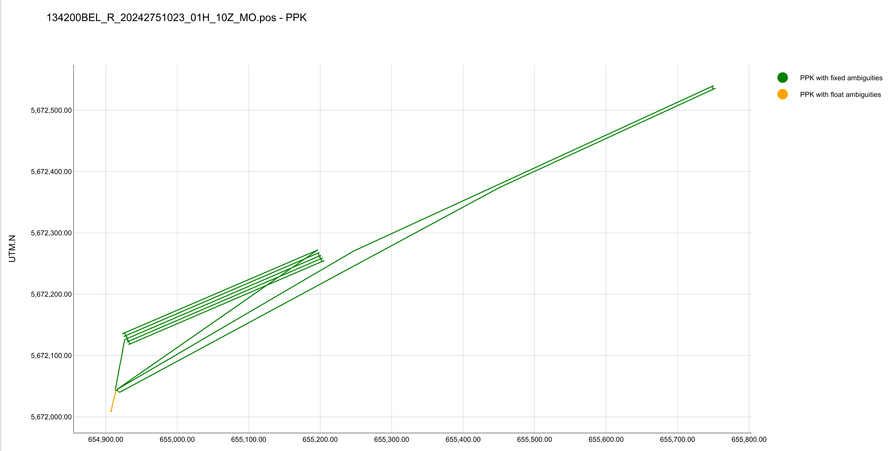
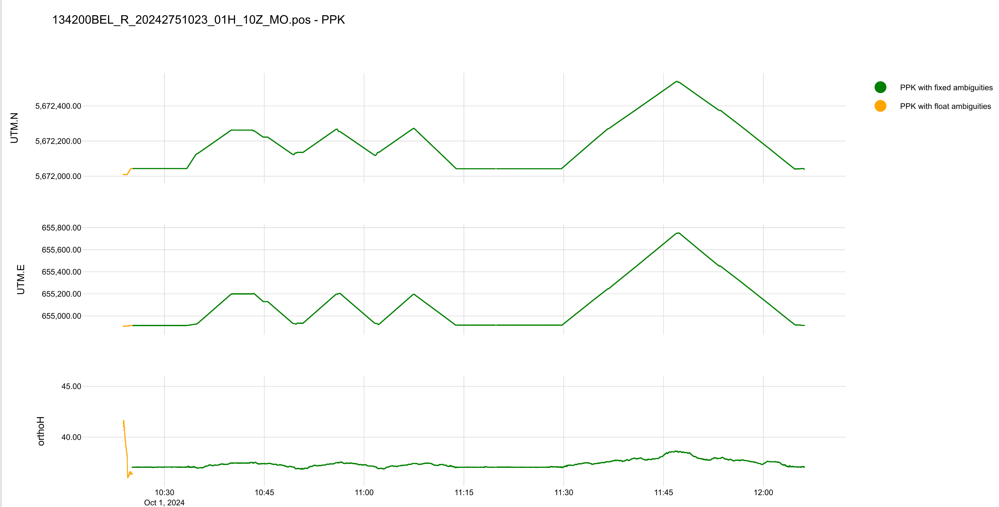

## The plot functions

### The script `plot_coords`

The script `plot_coords` is used to plot the coordinates of the GNSS stations. The script plots the UTM `(UTM.E, UTM.N` and orthometric height `orthoH` 

```bash
± plot_coords -h
usage: plot_coords [-h] [-V] [-v] (--sbf_fn SBF_FN | --pos_fn POS_FN | --glab_fn GLAB_FN) 
[--sd] [--title TITLE] [--display]

argument_parser.py: Plot UTM scatter and line plots from data files. 
Note: The plotting options --sbf_fn, --pos_fn, and --glib_fn are mutually exclusive. 
You must choose exactly one of these options.

options:
  -h, --help         show this help message and exit
  -V, --version      show program's version number and exit
  -v, --verbose      verbose level... repeat up to three times.
  --sbf_fn SBF_FN    input SBF filename
  --pos_fn POS_FN    input rnx2rtkp pos filename
  --glab_fn GLAB_FN  input gLABng filename
  --sd               add standard deviation to the plot
  --title TITLE      title for plot
  --display          display plots (default False)
```

The options `--sbf_fn`, `--pos_fn`, and `--glab_fn` are mutually exclusive. You must choose exactly one of these options. Based on the selected option, the script will run  the corresponding script and retain from the created dataframe the columns defined in `plot_columns.py`. Following plots are created:

- A scatter plot of the UTM coordinates `(UTM.E, UTM.N)`

    

- Line plots of the orthometric height `UTM.E`, `UTM.N` nd `orthoH` as a function of time `DT`.

    


---

Return to  [top level readme](../../../README.md)
