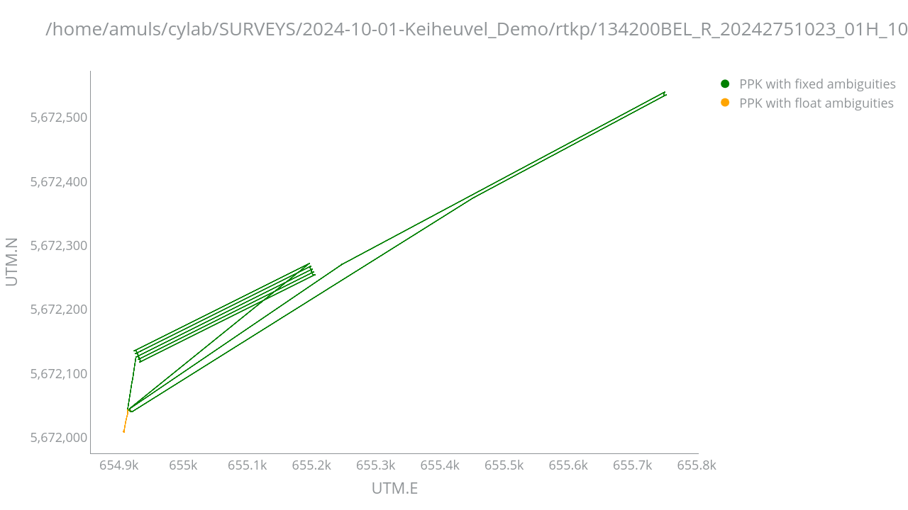

## RTKPos related classes and functions

The `RTKPos` class is used to read and parse the position and status files obtained by RTKLib processing.  The class has the following fields:
- `pos_fn`: the SBF filename, mandatory
- `start_time`: the start time of the SBF file, optional
- `end_time`: the end time of the SBF file, optional
- `logger`: the logger object, optional

    - _Remark: for using the RTKLib created position file with the [polars dataframe](https://docs.pola.rs/) the position file has to be created with the `-s sep :   field separator [' ']` option to obtain a CSV file._

The class has the following methods:
- `def rtkpos_schema(self) -> dict:`
    This method returns a dictionary with the column names and the [polars](https://docs.pola.rs/) dtypes for the columns found in the RTKPos CSV position file, reducing the memory usage of the  [polars dataframe](https://docs.pola.rs/).

- `def info_processing(self) -> Tuple[dict, list]:`
    This method returns a tuple containing:
        - a dictionary with the processing information extracted from the RTKPos CSV position file (cfr extract below)
        - a list containing the column names of the RTKPos CSV position file, by replacing the `"GPST"` column name with `"WNc", "TOW(s)"`.
```bash
% program   : rnx2rtkp ver.demo5 b34g
% inp file  : rnx/ROVR00BEL_R_20241701647_05H_10Z_MO.rnx
% inp file  : rnx/SSEA00XXX_R_20241701639_05H_01S_MO.rnx
% inp file  : rnx/SSEA00XXX_R_20241701620_06H_MN.rnx
% obs start : 2024/06/18 16:47:43.0 GPST (week2319 233263.0s)
% obs end   : 2024/06/18 21:03:43.1 GPST (week2319 248623.1s)
% ref pos   : 33.241210525,-115.951228361,  -66.0251
%
% (lat/lon/height=WGS84/ellipsoidal,Q=1:fix,2:float,3:sbas,4:dgps,5:single,6:ppp,ns=# of satellites)
%  GPST      , latitude(deg),longitude(deg), height(m),  Q, ns,  sdn(m),  sde(m),  sdu(m), sdne(m), sdeu(m), sdun(m),age(s), ratio
```

- `def add_columns(self, df_pos: pl.DataFrame) -> pl.DataFrame:`
    Similar to the `add_columns` method of the `Sbf` class, but for the RTKPos CSV position file.

## Python scripts with a main function

### The script `rtk_pvtgeod.py`

```bash
± rtk_pvtgeod.py -h
usage: rtk_pvtgeod.py [-h] --sbf_fn SBF_FN [--sbf2asc] [-V] [-v]

argument_parser.py analysis of SBF data

options:
  -h, --help       show this help message and exit
  --sbf_fn SBF_FN  input SBF filename
  --sbf2asc        Using sbf2asc instead of bin2asc as sbf converter.
  -V, --version    show program's version number and exit
  -v, --verbose    verbose level... repeat up to three times.
```
This script reads the SBF file and extracts the PVTGeodetic2 block and writes the data to  [polars dataframe](https://docs.pola.rs/) with selected columns.

```bash
$ rtk_pvtgeod.py --sbf_fn /home/amuls/cylab/TESTDATA/analysegnss_data/1342172Z.24_ -vv
2024-11-27 13:23:41,867 [WARNING](rtk_pvtgeod:logger_setup:80): ---------- START of rtk_pvtgeod ----------
2024-11-27 13:23:41,875 [INFO](rtk_pvtgeod:rtk_pvtgeod:61): Parsed arguments: Namespace(sbf_fn='/home/amuls/cylab/TESTDATA/analysegnss_data/1342172Z.24_', sbf2asc=False, verbose=2)
2024-11-27 13:23:41,875 [INFO](rtk_pvtgeod:validate_file:53): File validated successfully: /home/amuls/cylab/TESTDATA/analysegnss_data/1342172Z.24_
2024-11-27 13:23:41,875 [INFO](rtk_pvtgeod:validate_start_time:72): No start time specified.
2024-11-27 13:23:41,875 [INFO](rtk_pvtgeod:validate_end_time:91): No end time specified.
2024-11-27 13:23:41,875 [INFO](rtk_pvtgeod:validate_logger_level:104): Console log level set to INFO
2024-11-27 13:23:41,875 [INFO](rtk_pvtgeod:bin2asc_dataframe:127): /opt/Septentrio/RxTools/bin/bin2asc conversion of SBF file /home/amuls/cylab/TESTDATA/analysegnss_data/1342172Z.24_ to CSV files and importing into dataframes for SBF blocks
PVTGeodetic2
Errors occurred during decoding of data (see output files).
2024-11-27 13:23:50,995 [INFO](rtk_pvtgeod:used_columns:587): Keeping columns: 
{'Latitude [rad]': Float64, 'Longitude [rad]': Float64, 'Height [m]': Float64, 'Undulation [m]': Float32, 'COG [°]': Float32, 'TOW [0.001 s]': UInt32, 'SignalInfo': UInt32, 'WNc [w]': UInt16, 'MeanCorrAge [0.01 s]': UInt16, 'Type': UInt8, 'Error': UInt8, 'NrSV': UInt8}
2024-11-27 13:23:51,019 [INFO](rtk_pvtgeod:add_columns:347): 	removing rows with no PVT solution
2024-11-27 13:23:51,022 [INFO](rtk_pvtgeod:add_columns:356): 	adding datetime column to the dataframe
2024-11-27 13:23:51,024 [INFO](rtk_pvtgeod:add_columns:384): 	adding UTM coordinates to the dataframe
2024-11-27 13:23:51,025 [INFO](rtk_pvtgeod:add_columns:434): 	adding orthometric height to the dataframe
2024-11-27 13:23:51,026 [WARNING](rtk_pvtgeod:add_columns:445): 	collecting the dataframe. Be patient.

Analysis of the quality of the position data
╒═══════════════════════════╤═════════╤══════════════╕
│ PNT Mode                  │   Count │ Percentage   │
╞═══════════════════════════╪═════════╪══════════════╡
│ RTK with fixed ambiguities │  114423 │ 82.50%       │
│ Stand-Alone PVT           │   12522 │ 9.03%        │
│ RTK with float ambiguities │    5809 │ 4.19%        │
│ Differential PVT          │    5945 │ 4.29%        │
╘═══════════════════════════╧═════════╧══════════════╛
2024-11-27 13:23:56,924 [WARNING](rtk_pvtgeod:quality_analysis:43): Quality analysis:
╒═══════════════════════════╤═════════╤══════════════╕
│ PNT Mode                  │   Count │ Percentage   │
╞═══════════════════════════╪═════════╪══════════════╡
│ RTK with fixed ambiguities │  114423 │ 82.50%       │
│ Stand-Alone PVT           │   12522 │ 9.03%        │
│ RTK with float ambiguities │    5809 │ 4.19%        │
│ Differential PVT          │    5945 │ 4.29%        │
╘═══════════════════════════╧═════════╧══════════════╛
2024-11-27 13:23:56,927 [INFO](rtk_pvtgeod:rtk_pvtgeod:82): df_geod: 
shape: (138_699, 16)
┌───────────────┬─────────┬──────┬───────┬────────────┬────────────────┬─────────┬──────┬──────────────────────┬────────────┬──────────────┬────────────────┬─────────────────┬────────────┬─────────────┬────────┐
│ TOW [0.001 s] ┆ WNc [w] ┆ Type ┆ Error ┆ Height [m] ┆ Undulation [m] ┆ COG [°] ┆ NrSV ┆ MeanCorrAge [0.01 s] ┆ SignalInfo ┆ DT           ┆ latitude [deg] ┆ longitude [deg] ┆      UTM.E ┆       UTM.N ┆ orthoH │
│           --- ┆     --- ┆  --- ┆   --- ┆        --- ┆            --- ┆     --- ┆  --- ┆                  --- ┆        --- ┆ ---          ┆            --- ┆             --- ┆        --- ┆         --- ┆    --- │
│           u32 ┆     u16 ┆   u8 ┆    u8 ┆        f64 ┆            f32 ┆     f32 ┆   u8 ┆                  u16 ┆        u32 ┆ datetime[μs] ┆            f64 ┆             f64 ┆        f64 ┆         f64 ┆    f64 │
╞═══════════════╪═════════╪══════╪═══════╪════════════╪════════════════╪═════════╪══════╪══════════════════════╪════════════╪══════════════╪════════════════╪═════════════════╪════════════╪═════════════╪════════╡
│     397836600 ┆    2319 ┆    1 ┆     0 ┆     10.806 ┆        -33.362 ┆    null ┆    5 ┆                 null ┆     131072 ┆ 2024-06-20   ┆         33.147 ┆        -116.131 ┆ 581085.395 ┆ 3667949.655 ┆ 44.168 │
│               ┆         ┆      ┆       ┆            ┆                ┆         ┆      ┆                      ┆            ┆ 14:30:36.600 ┆                ┆                 ┆            ┆             ┆        │
│     397836700 ┆    2319 ┆    1 ┆     0 ┆     10.801 ┆        -33.362 ┆    null ┆    5 ┆                 null ┆     131072 ┆ 2024-06-20   ┆         33.147 ┆        -116.131 ┆ 581085.395 ┆ 3667949.656 ┆ 44.163 │
│               ┆         ┆      ┆       ┆            ┆                ┆         ┆      ┆                      ┆            ┆ 14:30:36.700 ┆                ┆                 ┆            ┆             ┆        │
│     397836800 ┆    2319 ┆    1 ┆     0 ┆     10.797 ┆        -33.362 ┆    null ┆    5 ┆                 null ┆     131072 ┆ 2024-06-20   ┆         33.147 ┆        -116.131 ┆ 581085.398 ┆ 3667949.657 ┆ 44.159 │
│               ┆         ┆      ┆       ┆            ┆                ┆         ┆      ┆                      ┆            ┆ 14:30:36.800 ┆                ┆                 ┆            ┆             ┆        │
│     397836900 ┆    2319 ┆    1 ┆     0 ┆     10.802 ┆        -33.362 ┆    null ┆    5 ┆                 null ┆     131072 ┆ 2024-06-20   ┆         33.147 ┆        -116.131 ┆ 581085.399 ┆ 3667949.656 ┆ 44.164 │
│               ┆         ┆      ┆       ┆            ┆                ┆         ┆      ┆                      ┆            ┆ 14:30:36.900 ┆                ┆                 ┆            ┆             ┆        │
│     397837000 ┆    2319 ┆    1 ┆     0 ┆     10.798 ┆        -33.362 ┆    null ┆    5 ┆                 null ┆     131072 ┆ 2024-06-20   ┆         33.147 ┆        -116.131 ┆ 581085.399 ┆ 3667949.655 ┆ 44.160 │
│               ┆         ┆      ┆       ┆            ┆                ┆         ┆      ┆                      ┆            ┆ 14:30:37     ┆                ┆                 ┆            ┆             ┆        │
│             … ┆       … ┆    … ┆     … ┆          … ┆              … ┆       … ┆    … ┆                    … ┆          … ┆ …            ┆              … ┆               … ┆          … ┆           … ┆      … │
│     412243600 ┆    2319 ┆    1 ┆     0 ┆      6.731 ┆        -33.355 ┆    null ┆   25 ┆                 null ┆ 1881300997 ┆ 2024-06-20   ┆         33.154 ┆        -116.136 ┆ 580559.375 ┆ 3668667.140 ┆ 40.086 │
│               ┆         ┆      ┆       ┆            ┆                ┆         ┆      ┆                      ┆            ┆ 18:30:43.600 ┆                ┆                 ┆            ┆             ┆        │
│     412243700 ┆    2319 ┆    1 ┆     0 ┆      6.720 ┆        -33.355 ┆    null ┆   25 ┆                 null ┆ 1881300997 ┆ 2024-06-20   ┆         33.154 ┆        -116.136 ┆ 580559.378 ┆ 3668667.139 ┆ 40.075 │
│               ┆         ┆      ┆       ┆            ┆                ┆         ┆      ┆                      ┆            ┆ 18:30:43.700 ┆                ┆                 ┆            ┆             ┆        │
│     412243800 ┆    2319 ┆    1 ┆     0 ┆      6.710 ┆        -33.355 ┆    null ┆   25 ┆                 null ┆ 1881300997 ┆ 2024-06-20   ┆         33.154 ┆        -116.136 ┆ 580559.381 ┆ 3668667.138 ┆ 40.065 │
│               ┆         ┆      ┆       ┆            ┆                ┆         ┆      ┆                      ┆            ┆ 18:30:43.800 ┆                ┆                 ┆            ┆             ┆        │
│     412243900 ┆    2319 ┆    1 ┆     0 ┆      6.701 ┆        -33.355 ┆    null ┆   25 ┆                 null ┆ 1881300997 ┆ 2024-06-20   ┆         33.154 ┆        -116.136 ┆ 580559.383 ┆ 3668667.139 ┆ 40.056 │
│               ┆         ┆      ┆       ┆            ┆                ┆         ┆      ┆                      ┆            ┆ 18:30:43.900 ┆                ┆                 ┆            ┆             ┆        │
│     412244000 ┆    2319 ┆    1 ┆     0 ┆      6.687 ┆        -33.355 ┆    null ┆   25 ┆                 null ┆ 1881300997 ┆ 2024-06-20   ┆         33.154 ┆        -116.136 ┆ 580559.386 ┆ 3668667.140 ┆ 40.042 │
│               ┆         ┆      ┆       ┆            ┆                ┆         ┆      ┆                      ┆            ┆ 18:30:44     ┆                ┆                 ┆            ┆             ┆        │
└───────────────┴─────────┴──────┴───────┴────────────┴────────────────┴─────────┴──────┴──────────────────────┴────────────┴──────────────┴────────────────┴─────────────────┴────────────┴─────────────┴────────┘
shape: (138_699, 16)
┌───────────────┬─────────┬──────┬───────┬────────────┬────────────────┬─────────┬──────┬──────────────────────┬────────────┬──────────────┬────────────────┬─────────────────┬────────────┬─────────────┬────────┐
│ TOW [0.001 s] ┆ WNc [w] ┆ Type ┆ Error ┆ Height [m] ┆ Undulation [m] ┆ COG [°] ┆ NrSV ┆ MeanCorrAge [0.01 s] ┆ SignalInfo ┆ DT           ┆ latitude [deg] ┆ longitude [deg] ┆      UTM.E ┆       UTM.N ┆ orthoH │
│           --- ┆     --- ┆  --- ┆   --- ┆        --- ┆            --- ┆     --- ┆  --- ┆                  --- ┆        --- ┆ ---          ┆            --- ┆             --- ┆        --- ┆         --- ┆    --- │
│           u32 ┆     u16 ┆   u8 ┆    u8 ┆        f64 ┆            f32 ┆     f32 ┆   u8 ┆                  u16 ┆        u32 ┆ datetime[μs] ┆            f64 ┆             f64 ┆        f64 ┆         f64 ┆    f64 │
╞═══════════════╪═════════╪══════╪═══════╪════════════╪════════════════╪═════════╪══════╪══════════════════════╪════════════╪══════════════╪════════════════╪═════════════════╪════════════╪═════════════╪════════╡
│     397836600 ┆    2319 ┆    1 ┆     0 ┆     10.806 ┆        -33.362 ┆    null ┆    5 ┆                 null ┆     131072 ┆ 2024-06-20   ┆         33.147 ┆        -116.131 ┆ 581085.395 ┆ 3667949.655 ┆ 44.168 │
│               ┆         ┆      ┆       ┆            ┆                ┆         ┆      ┆                      ┆            ┆ 14:30:36.600 ┆                ┆                 ┆            ┆             ┆        │
│     397836700 ┆    2319 ┆    1 ┆     0 ┆     10.801 ┆        -33.362 ┆    null ┆    5 ┆                 null ┆     131072 ┆ 2024-06-20   ┆         33.147 ┆        -116.131 ┆ 581085.395 ┆ 3667949.656 ┆ 44.163 │
│               ┆         ┆      ┆       ┆            ┆                ┆         ┆      ┆                      ┆            ┆ 14:30:36.700 ┆                ┆                 ┆            ┆             ┆        │
│     397836800 ┆    2319 ┆    1 ┆     0 ┆     10.797 ┆        -33.362 ┆    null ┆    5 ┆                 null ┆     131072 ┆ 2024-06-20   ┆         33.147 ┆        -116.131 ┆ 581085.398 ┆ 3667949.657 ┆ 44.159 │
│               ┆         ┆      ┆       ┆            ┆                ┆         ┆      ┆                      ┆            ┆ 14:30:36.800 ┆                ┆                 ┆            ┆             ┆        │
│     397836900 ┆    2319 ┆    1 ┆     0 ┆     10.802 ┆        -33.362 ┆    null ┆    5 ┆                 null ┆     131072 ┆ 2024-06-20   ┆         33.147 ┆        -116.131 ┆ 581085.399 ┆ 3667949.656 ┆ 44.164 │
│               ┆         ┆      ┆       ┆            ┆                ┆         ┆      ┆                      ┆            ┆ 14:30:36.900 ┆                ┆                 ┆            ┆             ┆        │
│     397837000 ┆    2319 ┆    1 ┆     0 ┆     10.798 ┆        -33.362 ┆    null ┆    5 ┆                 null ┆     131072 ┆ 2024-06-20   ┆         33.147 ┆        -116.131 ┆ 581085.399 ┆ 3667949.655 ┆ 44.160 │
│               ┆         ┆      ┆       ┆            ┆                ┆         ┆      ┆                      ┆            ┆ 14:30:37     ┆                ┆                 ┆            ┆             ┆        │
│             … ┆       … ┆    … ┆     … ┆          … ┆              … ┆       … ┆    … ┆                    … ┆          … ┆ …            ┆              … ┆               … ┆          … ┆           … ┆      … │
│     412243600 ┆    2319 ┆    1 ┆     0 ┆      6.731 ┆        -33.355 ┆    null ┆   25 ┆                 null ┆ 1881300997 ┆ 2024-06-20   ┆         33.154 ┆        -116.136 ┆ 580559.375 ┆ 3668667.140 ┆ 40.086 │
│               ┆         ┆      ┆       ┆            ┆                ┆         ┆      ┆                      ┆            ┆ 18:30:43.600 ┆                ┆                 ┆            ┆             ┆        │
│     412243700 ┆    2319 ┆    1 ┆     0 ┆      6.720 ┆        -33.355 ┆    null ┆   25 ┆                 null ┆ 1881300997 ┆ 2024-06-20   ┆         33.154 ┆        -116.136 ┆ 580559.378 ┆ 3668667.139 ┆ 40.075 │
│               ┆         ┆      ┆       ┆            ┆                ┆         ┆      ┆                      ┆            ┆ 18:30:43.700 ┆                ┆                 ┆            ┆             ┆        │
│     412243800 ┆    2319 ┆    1 ┆     0 ┆      6.710 ┆        -33.355 ┆    null ┆   25 ┆                 null ┆ 1881300997 ┆ 2024-06-20   ┆         33.154 ┆        -116.136 ┆ 580559.381 ┆ 3668667.138 ┆ 40.065 │
│               ┆         ┆      ┆       ┆            ┆                ┆         ┆      ┆                      ┆            ┆ 18:30:43.800 ┆                ┆                 ┆            ┆             ┆        │
│     412243900 ┆    2319 ┆    1 ┆     0 ┆      6.701 ┆        -33.355 ┆    null ┆   25 ┆                 null ┆ 1881300997 ┆ 2024-06-20   ┆         33.154 ┆        -116.136 ┆ 580559.383 ┆ 3668667.139 ┆ 40.056 │
│               ┆         ┆      ┆       ┆            ┆                ┆         ┆      ┆                      ┆            ┆ 18:30:43.900 ┆                ┆                 ┆            ┆             ┆        │
│     412244000 ┆    2319 ┆    1 ┆     0 ┆      6.687 ┆        -33.355 ┆    null ┆   25 ┆                 null ┆ 1881300997 ┆ 2024-06-20   ┆         33.154 ┆        -116.136 ┆ 580559.386 ┆ 3668667.140 ┆ 40.042 │
│               ┆         ┆      ┆       ┆            ┆                ┆         ┆      ┆                      ┆            ┆ 18:30:44     ┆                ┆                 ┆            ┆             ┆        │
└───────────────┴─────────┴──────┴───────┴────────────┴────────────────┴─────────┴──────┴──────────────────────┴────────────┴──────────────┴────────────────┴─────────────────┴────────────┴─────────────┴────────┘

```

The created polars dataframe is returned and can thus be used by another script which calls this script.

### The script `ppk_rnx2rtkp.py`

```bash
± ppk_rnx2rtkp.py -h
usage: ppk_rnx2rtkp.py [-h] [-V] [-v] --pos_fn POS_FN

argument_parser.py analysis of rnx2rtkp position file

options:
  -h, --help       show this help message and exit
  -V, --version    show program's version number and exit
  -v, --verbose    verbose level... repeat up to three times.
  --pos_fn POS_FN  input rnx2rtkp pos filename
```

This script reads the CSV position file and returns a polar dataframe.`
```bash
$ ppk_rnx2rtkp.py --pos_fn /home/amuls/cylab/SURVEYS/2024-10-01-Keiheuvel_Demo/rtkp/134200BEL_R_20242751023_01H_10Z_MO.pos -vv
2024-11-27 16:02:50,440 [WARNING](ppk_rnx2rtkp:logger_setup:80): ---------- START of ppk_rnx2rtkp ----------
2024-11-27 16:02:50,441 [INFO](ppk_rnx2rtkp:validate_file:51): File validated successfully: /home/amuls/cylab/SURVEYS/2024-10-01-Keiheuvel_Demo/rtkp/134200BEL_R_20242751023_01H_10Z_MO.pos
2024-11-27 16:02:50,441 [INFO](ppk_rnx2rtkp:validate_start_time:75): No start time specified.
2024-11-27 16:02:50,441 [INFO](ppk_rnx2rtkp:validate_end_time:99): No end time specified.
2024-11-27 16:02:50,441 [INFO](ppk_rnx2rtkp:validate_logger_level:112): Console log level set to INFO
2024-11-27 16:02:50,441 [INFO](ppk_rnx2rtkp:info_processing:255): Processing info:
{
    "program": "rnx2rtkp ver.demo5 b34k MKL",
    "obs start": "2024/10/01 10:23:50.0 GPST (week2334 210230.0s)",
    "obs end": "2024/10/01 12:07:00.3 GPST (week2334 216420.3s)",
    "ref pos": "51.178778806    5.216377034    83.2076",
    "rover_obs": "rnx/134200BEL_R_20242751023_01H_10Z_MO.rnx",
    "base_obs": "rnx/base00BEL_R_20242751022_01H_05S_MO.rnx",
    "brdc_nav": "rnx/base00BEL_R_20242751021_01H_MN.rnx"
}
2024-11-27 16:02:50,600 [INFO](ppk_rnx2rtkp:add_columns:274): 	adding datetime to the dataframe
2024-11-27 16:02:50,611 [INFO](ppk_rnx2rtkp:add_columns:287): 	adding UTM coordinates to the dataframe
2024-11-27 16:02:50,615 [INFO](ppk_rnx2rtkp:add_columns:325): 	adding geoid undulation & orthometric height to the dataframe
2024-11-27 16:02:50,620 [INFO](ppk_rnx2rtkp:add_columns:360): 	collecting the dataframe. Be patient.
Processing info:
{
    "program": "rnx2rtkp ver.demo5 b34k MKL",
    "obs start": "2024/10/01 10:23:50.0 GPST (week2334 210230.0s)",
    "obs end": "2024/10/01 12:07:00.3 GPST (week2334 216420.3s)",
    "ref pos": "51.178778806    5.216377034    83.2076",
    "rover_obs": "rnx/134200BEL_R_20242751023_01H_10Z_MO.rnx",
    "base_obs": "rnx/base00BEL_R_20242751022_01H_05S_MO.rnx",
    "brdc_nav": "rnx/base00BEL_R_20242751021_01H_MN.rnx"
}

Analysis of the quality of the position data
╒═══════════════════════════╤═════════╤══════════════╕
│ PNT Mode                  │   Count │   Percentage │
╞═══════════════════════════╪═════════╪══════════════╡
│ PPK with fixed ambiguities │   60606 │        98.71 │
│ PPK with float ambiguities │     795 │         1.29 │
╘═══════════════════════════╧═════════╧══════════════╛
2024-11-27 16:02:54,432 [WARNING](ppk_rnx2rtkp:quality_analysis:45): 
╒═══════════════════════════╤═════════╤══════════════╕
│ PNT Mode                  │   Count │   Percentage │
╞═══════════════════════════╪═════════╪══════════════╡
│ PPK with fixed ambiguities │   60606 │        98.71 │
│ PPK with float ambiguities │     795 │         1.29 │
╘═══════════════════════════╧═════════╧══════════════╛
shape: (61_401, 20)
┌──────┬────────────┬───────────────┬───────────────┬───────────┬─────┬─────┬────────┬────────┬────────┬─────────┬─────────┬─────────┬────────┬───────┬───────────────┬────────────┬─────────────┬────────────┬────────┐
│  WNc ┆     TOW(s) ┆ latitude(deg) ┆ longitude(deg ┆ height(m) ┆   Q ┆  ns ┆ sdn(m) ┆ sde(m) ┆ sdu(m) ┆ sdne(m) ┆ sdeu(m) ┆ sdun(m) ┆ age(s) ┆ ratio ┆ DT            ┆      UTM.E ┆       UTM.N ┆ undulation ┆ orthoH │
│  --- ┆        --- ┆           --- ┆             ) ┆       --- ┆ --- ┆ --- ┆    --- ┆    --- ┆    --- ┆     --- ┆     --- ┆     --- ┆    --- ┆   --- ┆ ---           ┆        --- ┆         --- ┆        --- ┆    --- │
│  i64 ┆        f64 ┆           f64 ┆           --- ┆       f64 ┆ i16 ┆ i16 ┆    f32 ┆    f32 ┆    f32 ┆     f32 ┆     f32 ┆     f32 ┆    f32 ┆   f32 ┆ datetime[μs]  ┆        f64 ┆         f64 ┆        f64 ┆    f64 │
│      ┆            ┆               ┆           f64 ┆           ┆     ┆     ┆        ┆        ┆        ┆         ┆         ┆         ┆        ┆       ┆               ┆            ┆             ┆            ┆        │
╞══════╪════════════╪═══════════════╪═══════════════╪═══════════╪═════╪═════╪════════╪════════╪════════╪═════════╪═════════╪═════════╪════════╪═══════╪═══════════════╪════════════╪═════════════╪════════════╪════════╡
│ 2334 ┆ 210230.028 ┆        51.178 ┆         5.216 ┆    86.085 ┆   2 ┆   7 ┆  2.098 ┆  1.496 ┆  4.426 ┆  -0.854 ┆  -1.170 ┆   1.126 ┆  0.000 ┆ 0.000 ┆ 2024-10-01    ┆ 654907.120 ┆ 5672008.648 ┆     45.043 ┆ 41.042 │
│      ┆            ┆               ┆               ┆           ┆     ┆     ┆        ┆        ┆        ┆         ┆         ┆         ┆        ┆       ┆ 10:23:50.028  ┆            ┆             ┆            ┆        │
│ 2334 ┆ 210230.128 ┆        51.178 ┆         5.216 ┆    86.057 ┆   2 ┆   7 ┆  1.546 ┆  1.096 ┆  3.253 ┆  -0.652 ┆  -0.828 ┆   0.799 ┆  0.100 ┆ 0.000 ┆ 2024-10-01    ┆ 654907.124 ┆ 5672008.667 ┆     45.043 ┆ 41.014 │
│      ┆            ┆               ┆               ┆           ┆     ┆     ┆        ┆        ┆        ┆         ┆         ┆         ┆        ┆       ┆ 10:23:50.128  ┆            ┆             ┆            ┆        │
│ 2334 ┆ 210230.228 ┆        51.178 ┆         5.216 ┆    85.754 ┆   2 ┆   7 ┆  1.272 ┆  0.887 ┆  2.681 ┆  -0.573 ┆  -0.638 ┆   0.681 ┆  0.200 ┆ 0.000 ┆ 2024-10-01    ┆ 654907.363 ┆ 5672008.850 ┆     45.043 ┆ 40.711 │
│      ┆            ┆               ┆               ┆           ┆     ┆     ┆        ┆        ┆        ┆         ┆         ┆         ┆        ┆       ┆ 10:23:50.228  ┆            ┆             ┆            ┆        │
│ 2334 ┆ 210230.328 ┆        51.178 ┆         5.216 ┆    86.172 ┆   2 ┆   7 ┆  1.106 ┆  0.759 ┆  2.280 ┆  -0.515 ┆  -0.488 ┆   0.614 ┆  0.300 ┆ 0.000 ┆ 2024-10-01    ┆ 654907.358 ┆ 5672008.892 ┆     45.043 ┆ 41.129 │
│      ┆            ┆               ┆               ┆           ┆     ┆     ┆        ┆        ┆        ┆         ┆         ┆         ┆        ┆       ┆ 10:23:50.328  ┆            ┆             ┆            ┆        │
│ 2334 ┆ 210230.428 ┆        51.178 ┆         5.216 ┆    86.427 ┆   2 ┆   8 ┆  0.979 ┆  0.674 ┆  2.008 ┆  -0.473 ┆  -0.397 ┆   0.590 ┆  0.400 ┆ 0.000 ┆ 2024-10-01    ┆ 654907.366 ┆ 5672008.902 ┆     45.043 ┆ 41.384 │
│      ┆            ┆               ┆               ┆           ┆     ┆     ┆        ┆        ┆        ┆         ┆         ┆         ┆        ┆       ┆ 10:23:50.428  ┆            ┆             ┆            ┆        │
│    … ┆          … ┆             … ┆             … ┆         … ┆   … ┆   … ┆      … ┆      … ┆      … ┆       … ┆       … ┆       … ┆      … ┆     … ┆ …             ┆          … ┆           … ┆          … ┆      … │
│ 2334 ┆ 216369.600 ┆        51.179 ┆         5.216 ┆    82.131 ┆   1 ┆  17 ┆  0.013 ┆  0.008 ┆  0.015 ┆  -0.006 ┆  -0.003 ┆  -0.004 ┆ 29.600 ┆ 4.900 ┆ 2024-10-01    ┆ 654913.563 ┆ 5672039.354 ┆     45.042 ┆ 37.088 │
│      ┆            ┆               ┆               ┆           ┆     ┆     ┆        ┆        ┆        ┆         ┆         ┆         ┆        ┆       ┆ 12:06:09.600  ┆            ┆             ┆            ┆        │
│ 2334 ┆ 216369.700 ┆        51.179 ┆         5.216 ┆    82.131 ┆   1 ┆  17 ┆  0.013 ┆  0.008 ┆  0.015 ┆  -0.006 ┆  -0.003 ┆  -0.004 ┆ 29.700 ┆ 4.900 ┆ 2024-10-01    ┆ 654913.559 ┆ 5672039.295 ┆     45.042 ┆ 37.088 │
│      ┆            ┆               ┆               ┆           ┆     ┆     ┆        ┆        ┆        ┆         ┆         ┆         ┆        ┆       ┆ 12:06:09.700  ┆            ┆             ┆            ┆        │
│ 2334 ┆ 216369.800 ┆        51.179 ┆         5.216 ┆    82.130 ┆   1 ┆  17 ┆  0.013 ┆  0.008 ┆  0.015 ┆  -0.006 ┆  -0.003 ┆  -0.004 ┆ 29.800 ┆ 4.900 ┆ 2024-10-01    ┆ 654913.550 ┆ 5672039.230 ┆     45.042 ┆ 37.088 │
│      ┆            ┆               ┆               ┆           ┆     ┆     ┆        ┆        ┆        ┆         ┆         ┆         ┆        ┆       ┆ 12:06:09.800  ┆            ┆             ┆            ┆        │
│ 2334 ┆ 216369.900 ┆        51.179 ┆         5.216 ┆    82.132 ┆   1 ┆  17 ┆  0.013 ┆  0.008 ┆  0.015 ┆  -0.006 ┆  -0.003 ┆  -0.004 ┆ 29.900 ┆ 4.900 ┆ 2024-10-01    ┆ 654913.541 ┆ 5672039.167 ┆     45.042 ┆ 37.090 │
│      ┆            ┆               ┆               ┆           ┆     ┆     ┆        ┆        ┆        ┆         ┆         ┆         ┆        ┆       ┆ 12:06:09.900  ┆            ┆             ┆            ┆        │
│ 2334 ┆ 216370.000 ┆        51.179 ┆         5.216 ┆    82.134 ┆   1 ┆  17 ┆  0.013 ┆  0.008 ┆  0.015 ┆  -0.006 ┆  -0.003 ┆  -0.004 ┆ 30.000 ┆ 5.000 ┆ 2024-10-01    ┆ 654913.530 ┆ 5672039.100 ┆     45.042 ┆ 37.092 │
│      ┆            ┆               ┆               ┆           ┆     ┆     ┆        ┆        ┆        ┆         ┆         ┆         ┆        ┆       ┆ 12:06:10      ┆            ┆             ┆            ┆        │
└──────┴────────────┴───────────────┴───────────────┴───────────┴─────┴─────┴────────┴────────┴────────┴─────────┴─────────┴─────────┴────────┴───────┴───────────────┴────────────┴─────────────┴────────────┴────────┘
```

### The script `rtkppk_plot.py`

This script plots the data obtained from the polars dataframe created by the script `rtk_pvtgeod.py` or `ppk_rnx2rtkp.py`.

_Remark: currently only implemented for the RTK solution_

The script calls one of the previous scripts to create the polars dataframe, extracts the columns needed for plotting and plots the data.

```bash
± $ rtkppk_plot.py -h
usage: rtkppk_plot.py [-h] [-V] [-v] [--title TITLE] [--plot] (--pos_fn POS_FN | --sbf_fn SBF_FN)

argument_parser.py Plot PPK (from ppk_rnx2rtkp.py) or RTK (from rtk_pvtgeod.py) data

options:
  -h, --help       show this help message and exit
  -V, --version    show program's version number and exit
  -v, --verbose    verbose level... repeat up to three times.
  --title TITLE    title for plot
  --plot           display plots (default False)
  --pos_fn POS_FN  input rnx2rtkp pos filename
  --sbf_fn SBF_FN  input SBF filename
```

```bash
$ rtkppk_plot.py --pos_fn /home/amuls/cylab/SURVEYS/2024-10-01-Keiheuvel_Demo/rtkp/134200BEL_R_20242751023_01H_10Z_MO.pos -vv --plot
Parsed arguments: {'verbose': 2, 'title': None, 'plot': True, 'pos_fn': '/home/amuls/cylab/SURVEYS/2024-10-01-Keiheuvel_Demo/rtkp/134200BEL_R_20242751023_01H_10Z_MO.pos', 'sbf_fn': None}
2024-11-27 16:05:53,386 [WARNING](rtkppk_plot:logger_setup:80): ---------- START of rtkppk_plot ----------
2024-11-27 16:05:53,387 [INFO](rtkppk_plot:rtkppk_plot:31): Parsed arguments: Namespace(verbose=2, title=None, plot=True, pos_fn='/home/amuls/cylab/SURVEYS/2024-10-01-Keiheuvel_Demo/rtkp/134200BEL_R_20242751023_01H_10Z_MO.pos', sbf_fn=None)
Processing info:
{
    "program": "rnx2rtkp ver.demo5 b34k MKL",
    "obs start": "2024/10/01 10:23:50.0 GPST (week2334 210230.0s)",
    "obs end": "2024/10/01 12:07:00.3 GPST (week2334 216420.3s)",
    "ref pos": "51.178778806    5.216377034    83.2076",
    "rover_obs": "rnx/134200BEL_R_20242751023_01H_10Z_MO.rnx",
    "base_obs": "rnx/base00BEL_R_20242751022_01H_05S_MO.rnx",
    "brdc_nav": "rnx/base00BEL_R_20242751021_01H_MN.rnx"
}

Analysis of the quality of the position data
╒═══════════════════════════╤═════════╤══════════════╕
│ PNT Mode                  │   Count │   Percentage │
╞═══════════════════════════╪═════════╪══════════════╡
│ PPK with fixed ambiguities │   60606 │        98.71 │
│ PPK with float ambiguities │     795 │         1.29 │
╘═══════════════════════════╧═════════╧══════════════╛
2024-11-27 16:05:56,849 [INFO](rtkppk_plot:rtkppk_plot:48): df_pos = 
shape: (61_401, 20)
┌──────┬────────────┬───────────────┬───────────────┬───────────┬─────┬─────┬────────┬────────┬────────┬─────────┬─────────┬─────────┬────────┬───────┬───────────────┬────────────┬─────────────┬────────────┬────────┐
│  WNc ┆     TOW(s) ┆ latitude(deg) ┆ longitude(deg ┆ height(m) ┆   Q ┆  ns ┆ sdn(m) ┆ sde(m) ┆ sdu(m) ┆ sdne(m) ┆ sdeu(m) ┆ sdun(m) ┆ age(s) ┆ ratio ┆ DT            ┆      UTM.E ┆       UTM.N ┆ undulation ┆ orthoH │
│  --- ┆        --- ┆           --- ┆             ) ┆       --- ┆ --- ┆ --- ┆    --- ┆    --- ┆    --- ┆     --- ┆     --- ┆     --- ┆    --- ┆   --- ┆ ---           ┆        --- ┆         --- ┆        --- ┆    --- │
│  i64 ┆        f64 ┆           f64 ┆           --- ┆       f64 ┆ i16 ┆ i16 ┆    f32 ┆    f32 ┆    f32 ┆     f32 ┆     f32 ┆     f32 ┆    f32 ┆   f32 ┆ datetime[μs]  ┆        f64 ┆         f64 ┆        f64 ┆    f64 │
│      ┆            ┆               ┆           f64 ┆           ┆     ┆     ┆        ┆        ┆        ┆         ┆         ┆         ┆        ┆       ┆               ┆            ┆             ┆            ┆        │
╞══════╪════════════╪═══════════════╪═══════════════╪═══════════╪═════╪═════╪════════╪════════╪════════╪═════════╪═════════╪═════════╪════════╪═══════╪═══════════════╪════════════╪═════════════╪════════════╪════════╡
│ 2334 ┆ 210230.028 ┆        51.178 ┆         5.216 ┆    86.085 ┆   2 ┆   7 ┆  2.098 ┆  1.496 ┆  4.426 ┆  -0.854 ┆  -1.170 ┆   1.126 ┆  0.000 ┆ 0.000 ┆ 2024-10-01    ┆ 654907.120 ┆ 5672008.648 ┆     45.043 ┆ 41.042 │
│      ┆            ┆               ┆               ┆           ┆     ┆     ┆        ┆        ┆        ┆         ┆         ┆         ┆        ┆       ┆ 10:23:50.028  ┆            ┆             ┆            ┆        │
│ 2334 ┆ 210230.128 ┆        51.178 ┆         5.216 ┆    86.057 ┆   2 ┆   7 ┆  1.546 ┆  1.096 ┆  3.253 ┆  -0.652 ┆  -0.828 ┆   0.799 ┆  0.100 ┆ 0.000 ┆ 2024-10-01    ┆ 654907.124 ┆ 5672008.667 ┆     45.043 ┆ 41.014 │
│      ┆            ┆               ┆               ┆           ┆     ┆     ┆        ┆        ┆        ┆         ┆         ┆         ┆        ┆       ┆ 10:23:50.128  ┆            ┆             ┆            ┆        │
│ 2334 ┆ 210230.228 ┆        51.178 ┆         5.216 ┆    85.754 ┆   2 ┆   7 ┆  1.272 ┆  0.887 ┆  2.681 ┆  -0.573 ┆  -0.638 ┆   0.681 ┆  0.200 ┆ 0.000 ┆ 2024-10-01    ┆ 654907.363 ┆ 5672008.850 ┆     45.043 ┆ 40.711 │
│      ┆            ┆               ┆               ┆           ┆     ┆     ┆        ┆        ┆        ┆         ┆         ┆         ┆        ┆       ┆ 10:23:50.228  ┆            ┆             ┆            ┆        │
│ 2334 ┆ 210230.328 ┆        51.178 ┆         5.216 ┆    86.172 ┆   2 ┆   7 ┆  1.106 ┆  0.759 ┆  2.280 ┆  -0.515 ┆  -0.488 ┆   0.614 ┆  0.300 ┆ 0.000 ┆ 2024-10-01    ┆ 654907.358 ┆ 5672008.892 ┆     45.043 ┆ 41.129 │
│      ┆            ┆               ┆               ┆           ┆     ┆     ┆        ┆        ┆        ┆         ┆         ┆         ┆        ┆       ┆ 10:23:50.328  ┆            ┆             ┆            ┆        │
│ 2334 ┆ 210230.428 ┆        51.178 ┆         5.216 ┆    86.427 ┆   2 ┆   8 ┆  0.979 ┆  0.674 ┆  2.008 ┆  -0.473 ┆  -0.397 ┆   0.590 ┆  0.400 ┆ 0.000 ┆ 2024-10-01    ┆ 654907.366 ┆ 5672008.902 ┆     45.043 ┆ 41.384 │
│      ┆            ┆               ┆               ┆           ┆     ┆     ┆        ┆        ┆        ┆         ┆         ┆         ┆        ┆       ┆ 10:23:50.428  ┆            ┆             ┆            ┆        │
│    … ┆          … ┆             … ┆             … ┆         … ┆   … ┆   … ┆      … ┆      … ┆      … ┆       … ┆       … ┆       … ┆      … ┆     … ┆ …             ┆          … ┆           … ┆          … ┆      … │
│ 2334 ┆ 216369.600 ┆        51.179 ┆         5.216 ┆    82.131 ┆   1 ┆  17 ┆  0.013 ┆  0.008 ┆  0.015 ┆  -0.006 ┆  -0.003 ┆  -0.004 ┆ 29.600 ┆ 4.900 ┆ 2024-10-01    ┆ 654913.563 ┆ 5672039.354 ┆     45.042 ┆ 37.088 │
│      ┆            ┆               ┆               ┆           ┆     ┆     ┆        ┆        ┆        ┆         ┆         ┆         ┆        ┆       ┆ 12:06:09.600  ┆            ┆             ┆            ┆        │
│ 2334 ┆ 216369.700 ┆        51.179 ┆         5.216 ┆    82.131 ┆   1 ┆  17 ┆  0.013 ┆  0.008 ┆  0.015 ┆  -0.006 ┆  -0.003 ┆  -0.004 ┆ 29.700 ┆ 4.900 ┆ 2024-10-01    ┆ 654913.559 ┆ 5672039.295 ┆     45.042 ┆ 37.088 │
│      ┆            ┆               ┆               ┆           ┆     ┆     ┆        ┆        ┆        ┆         ┆         ┆         ┆        ┆       ┆ 12:06:09.700  ┆            ┆             ┆            ┆        │
│ 2334 ┆ 216369.800 ┆        51.179 ┆         5.216 ┆    82.130 ┆   1 ┆  17 ┆  0.013 ┆  0.008 ┆  0.015 ┆  -0.006 ┆  -0.003 ┆  -0.004 ┆ 29.800 ┆ 4.900 ┆ 2024-10-01    ┆ 654913.550 ┆ 5672039.230 ┆     45.042 ┆ 37.088 │
│      ┆            ┆               ┆               ┆           ┆     ┆     ┆        ┆        ┆        ┆         ┆         ┆         ┆        ┆       ┆ 12:06:09.800  ┆            ┆             ┆            ┆        │
│ 2334 ┆ 216369.900 ┆        51.179 ┆         5.216 ┆    82.132 ┆   1 ┆  17 ┆  0.013 ┆  0.008 ┆  0.015 ┆  -0.006 ┆  -0.003 ┆  -0.004 ┆ 29.900 ┆ 4.900 ┆ 2024-10-01    ┆ 654913.541 ┆ 5672039.167 ┆     45.042 ┆ 37.090 │
│      ┆            ┆               ┆               ┆           ┆     ┆     ┆        ┆        ┆        ┆         ┆         ┆         ┆        ┆       ┆ 12:06:09.900  ┆            ┆             ┆            ┆        │
│ 2334 ┆ 216370.000 ┆        51.179 ┆         5.216 ┆    82.134 ┆   1 ┆  17 ┆  0.013 ┆  0.008 ┆  0.015 ┆  -0.006 ┆  -0.003 ┆  -0.004 ┆ 30.000 ┆ 5.000 ┆ 2024-10-01    ┆ 654913.530 ┆ 5672039.100 ┆     45.042 ┆ 37.092 │
│      ┆            ┆               ┆               ┆           ┆     ┆     ┆        ┆        ┆        ┆         ┆         ┆         ┆        ┆       ┆ 12:06:10      ┆            ┆             ┆            ┆        │
└──────┴────────────┴───────────────┴───────────────┴───────────┴─────┴─────┴────────┴────────┴────────┴─────────┴─────────┴─────────┴────────┴───────┴───────────────┴────────────┴─────────────┴────────────┴────────┘
2024-11-27 16:05:56,850 [INFO](rtkppk_plot:rtkppk_plot:49): df_utm = 
shape: (61_401, 6)
┌─────────────────────────┬─────┬─────┬────────────┬─────────────┬────────┐
│ DT                      ┆   Q ┆  ns ┆      UTM.E ┆       UTM.N ┆ orthoH │
│ ---                     ┆ --- ┆ --- ┆        --- ┆         --- ┆    --- │
│ datetime[μs]            ┆ i16 ┆ i16 ┆        f64 ┆         f64 ┆    f64 │
╞═════════════════════════╪═════╪═════╪════════════╪═════════════╪════════╡
│ 2024-10-01 10:23:50.028 ┆   2 ┆   7 ┆ 654907.120 ┆ 5672008.648 ┆ 41.042 │
│ 2024-10-01 10:23:50.128 ┆   2 ┆   7 ┆ 654907.124 ┆ 5672008.667 ┆ 41.014 │
│ 2024-10-01 10:23:50.228 ┆   2 ┆   7 ┆ 654907.363 ┆ 5672008.850 ┆ 40.711 │
│ 2024-10-01 10:23:50.328 ┆   2 ┆   7 ┆ 654907.358 ┆ 5672008.892 ┆ 41.129 │
│ 2024-10-01 10:23:50.428 ┆   2 ┆   8 ┆ 654907.366 ┆ 5672008.902 ┆ 41.384 │
│ …                       ┆   … ┆   … ┆          … ┆           … ┆      … │
│ 2024-10-01 12:06:09.600 ┆   1 ┆  17 ┆ 654913.563 ┆ 5672039.354 ┆ 37.088 │
│ 2024-10-01 12:06:09.700 ┆   1 ┆  17 ┆ 654913.559 ┆ 5672039.295 ┆ 37.088 │
│ 2024-10-01 12:06:09.800 ┆   1 ┆  17 ┆ 654913.550 ┆ 5672039.230 ┆ 37.088 │
│ 2024-10-01 12:06:09.900 ┆   1 ┆  17 ┆ 654913.541 ┆ 5672039.167 ┆ 37.090 │
│ 2024-10-01 12:06:10     ┆   1 ┆  17 ┆ 654913.530 ┆ 5672039.100 ┆ 37.092 │
└─────────────────────────┴─────┴─────┴────────────┴─────────────┴────────┘
2024-11-27 16:05:56,850 [INFO](rtkppk_plot:plot_utm_coords:25): utm_df = 
shape: (61_401, 6)
┌─────────────────────────┬─────┬─────┬───────────────┬──────────┬───────────┐
│ DT                      ┆ Q   ┆ ns  ┆ UTM.E         ┆ UTM.N    ┆ orthoH    │
│ ---                     ┆ --- ┆ --- ┆ ---           ┆ ---      ┆ ---       │
│ datetime[μs]            ┆ i16 ┆ i16 ┆ f64           ┆ f64      ┆ f64       │
╞═════════════════════════╪═════╪═════╪═══════════════╪══════════╪═══════════╡
│ 2024-10-01 10:23:50.028 ┆ 2   ┆ 7   ┆ 654907.120074 ┆ 5.6720e6 ┆ 41.041549 │
│ 2024-10-01 10:23:50.128 ┆ 2   ┆ 7   ┆ 654907.123774 ┆ 5.6720e6 ┆ 41.014049 │
│ 2024-10-01 10:23:50.228 ┆ 2   ┆ 7   ┆ 654907.362812 ┆ 5.6720e6 ┆ 40.710756 │
│ 2024-10-01 10:23:50.328 ┆ 2   ┆ 7   ┆ 654907.357547 ┆ 5.6720e6 ┆ 41.128557 │
│ 2024-10-01 10:23:50.428 ┆ 2   ┆ 8   ┆ 654907.365776 ┆ 5.6720e6 ┆ 41.383757 │
│ …                       ┆ …   ┆ …   ┆ …             ┆ …        ┆ …         │
│ 2024-10-01 12:06:09.600 ┆ 1   ┆ 17  ┆ 654913.563128 ┆ 5.6720e6 ┆ 37.08848  │
│ 2024-10-01 12:06:09.700 ┆ 1   ┆ 17  ┆ 654913.558625 ┆ 5.6720e6 ┆ 37.088379 │
│ 2024-10-01 12:06:09.800 ┆ 1   ┆ 17  ┆ 654913.550422 ┆ 5.6720e6 ┆ 37.088077 │
│ 2024-10-01 12:06:09.900 ┆ 1   ┆ 17  ┆ 654913.541417 ┆ 5.6720e6 ┆ 37.089775 │
│ 2024-10-01 12:06:10     ┆ 1   ┆ 17  ┆ 654913.530357 ┆ 5.6720e6 ┆ 37.091573 │
└─────────────────────────┴─────┴─────┴───────────────┴──────────┴───────────┘

```



### The script `ebh_lines.py`

```bash
± ebh_lines.py -h
usage: ebh_lines.py [-h] [-V] [-v] (--rtk | --ppk) --desc DESC --ebh_fn EBH_FN --timing_fn TIMING_FN [--plot]

argument_parser.py extracts the EBH lines from RTK or PPK created dataframe

options:
  -h, --help            show this help message and exit
  -V, --version         show program's version number and exit
  -v, --verbose         verbose level... repeat up to three times.
  --rtk                 extract lines from RTK solution
  --ppk                 extract lines from PPK solution
  --desc DESC           description of EBH lines project
  --ebh_fn EBH_FN       input RTK/PPK filename
  --timing_fn TIMING_FN
                        input ebh lines timing filename
```

Using the created polars dataframes in RTK or PPK mode, the script `ebh_lines.py` extracts the EBH lines from the RTK or PPK created dataframe based on timing information provided.

```bash
± ebh_lines.py --ppk --ebh_fn /home/amuls/GNSSData/USA_CA_2024/SaltonSea/rtkp/ROVR00BEL_R_20241701647_05H_10Z_MO.pos --timing_fn /home/amuls/GNSSData/USA_CA_2024/SaltonSea/salton_timings.txt --desc salton_sea -vv
2024-08-05 14:40:55,472 [INFO](ebh_lines:init_logger.pylogger_setup:78): ---------- start ebh_lines -------------
2024-08-05 14:40:55,472 [INFO](ebh_lines:ebh_lines.pyebh_lines:302): Parsed arguments: Namespace(verbose=2, rtk=False, ppk=True, desc='salton_sea', ebh_fn='/home/amuls/GNSSData/USA_CA_2024/SaltonSea/rtkp/ROVR00BEL_R_20241701647_05H_10Z_MO.pos', timing_fn='/home/amuls/GNSSData/USA_CA_2024/SaltonSea/salton_timings.txt', plot=False)
2024-08-05 14:40:55,472 [INFO](ebh_lines:ebh_lines.pyget_ppk_dataframe:44): ppk_rnx2rtkp_args = ['ppk_rnx2rtkp.py', '--pos_fn', '/home/amuls/GNSSData/USA_CA_2024/SaltonSea/rtkp/ROVR00BEL_R_20241701647_05H_10Z_MO.pos', '-vv']
2024-08-05 14:40:55,473 [INFO](ppk_rnx2rtkp:init_logger.pylogger_setup:78): ---------- start ppk_rnx2rtkp -------------
2024-08-05 14:40:55,473 [INFO](ppk_rnx2rtkp:ppk_rnx2rtkp.pyrtkp_pos:65): Parsed arguments: Namespace(verbose=2, pos_fn='/home/amuls/GNSSData/USA_CA_2024/SaltonSea/rtkp/ROVR00BEL_R_20241701647_05H_10Z_MO.pos')
2024-08-05 14:40:55,473 [INFO](ppk_rnx2rtkp:rtkpos_class.pyvalidate_file:46): File validated successfully: /home/amuls/GNSSData/USA_CA_2024/SaltonSea/rtkp/ROVR00BEL_R_20241701647_05H_10Z_MO.pos
2024-08-05 14:40:55,473 [INFO](ppk_rnx2rtkp:rtkpos_class.pyvalidate_start_time:67): No start time specified.
2024-08-05 14:40:55,473 [INFO](ppk_rnx2rtkp:rtkpos_class.pyvalidate_end_time:86): No end time specified.
2024-08-05 14:40:55,478 [INFO](ppk_rnx2rtkp:rtkpos_class.pyadd_columns:225): 	adding datetime to the dataframe
2024-08-05 14:40:55,482 [INFO](ppk_rnx2rtkp:rtkpos_class.pyadd_columns:237): 	adding UTM coordinates to the dataframe
2024-08-05 14:40:55,483 [INFO](ppk_rnx2rtkp:rtkpos_class.pyadd_columns:276): 	adding geoid undulation & orthometric height to the dataframe
2024-08-05 14:40:55,484 [WARNING](ppk_rnx2rtkp:rtkpos_class.pyadd_columns:298): 	collecting the dataframe. Be patient.

Analysis of the quality of the position data
2024-08-05 14:41:02,185 [WARNING](ppk_rnx2rtkp:ppk_rnx2rtkp.pyquality_analysis:35): ╒═══════════════════════════╤═════════╤══════════════╕
│ PNT Mode                  │   Count │ Percentage   │
╞═══════════════════════════╪═════════╪══════════════╡
│ PPK with fixed ambiguities │  141661 │ 98.09%       │
│ Differential PVT          │       3 │ 0.00%        │
│ PPK with float ambiguities │    2757 │ 1.91%        │
╘═══════════════════════════╧═════════╧══════════════╛
2024-08-05 14:41:02,186 [INFO](ebh_lines:ebh_lines.pyebh_lines:311): Dataframe obtained from PPK processing of /home/amuls/GNSSData/USA_CA_2024/SaltonSea/rtkp/ROVR00BEL_R_20241701647_05H_10Z_MO.pos
Dataframe obtained from PPK processing of /home/amuls/GNSSData/USA_CA_2024/SaltonSea/rtkp/ROVR00BEL_R_20241701647_05H_10Z_MO.pos
2024-08-05 14:41:02,186 [INFO](ebh_lines:ebh_lines.pyebh_lines:341): shape: (144_421, 6)
┌─────────────────────────┬─────┬─────┬───────────────┬──────────┬────────────┐
│ DT                      ┆ Q   ┆ ns  ┆ UTM.E         ┆ UTM.N    ┆ orthoH     │
│ ---                     ┆ --- ┆ --- ┆ ---           ┆ ---      ┆ ---        │
│ datetime[μs]            ┆ i16 ┆ i16 ┆ f64           ┆ f64      ┆ f64        │
╞═════════════════════════╪═════╪═════╪═══════════════╪══════════╪════════════╡
│ 2024-06-18 16:47:43     ┆ 2   ┆ 4   ┆ 597698.092701 ┆ 3.6785e6 ┆ -30.255437 │
│ 2024-06-18 16:47:43.100 ┆ 2   ┆ 4   ┆ 597698.377292 ┆ 3.6785e6 ┆ -30.36693  │
│ 2024-06-18 16:47:43.200 ┆ 2   ┆ 4   ┆ 597698.681733 ┆ 3.6785e6 ┆ -30.485423 │
│ 2024-06-18 16:47:43.300 ┆ 2   ┆ 4   ┆ 597699.179407 ┆ 3.6785e6 ┆ -30.674412 │
│ 2024-06-18 16:47:43.400 ┆ 2   ┆ 4   ┆ 597699.590065 ┆ 3.6785e6 ┆ -30.832803 │
│ …                       ┆ …   ┆ …   ┆ …             ┆ …        ┆ …          │
│ 2024-06-18 21:03:42.700 ┆ 1   ┆ 8   ┆ 597704.273984 ┆ 3.6785e6 ┆ -32.925398 │
│ 2024-06-18 21:03:42.800 ┆ 1   ┆ 8   ┆ 597704.274067 ┆ 3.6785e6 ┆ -32.926698 │
│ 2024-06-18 21:03:42.900 ┆ 1   ┆ 8   ┆ 597704.274896 ┆ 3.6785e6 ┆ -32.928297 │
│ 2024-06-18 21:03:43     ┆ 1   ┆ 8   ┆ 597704.275547 ┆ 3.6785e6 ┆ -32.928797 │
│ 2024-06-18 21:03:43.100 ┆ 1   ┆ 8   ┆ 597704.276395 ┆ 3.6785e6 ┆ -32.930297 │
└─────────────────────────┴─────┴─────┴───────────────┴──────────┴────────────┘
shape: (144_421, 6)
┌─────────────────────────┬─────┬─────┬───────────────┬──────────┬────────────┐
│ DT                      ┆ Q   ┆ ns  ┆ UTM.E         ┆ UTM.N    ┆ orthoH     │
│ ---                     ┆ --- ┆ --- ┆ ---           ┆ ---      ┆ ---        │
│ datetime[μs]            ┆ i16 ┆ i16 ┆ f64           ┆ f64      ┆ f64        │
╞═════════════════════════╪═════╪═════╪═══════════════╪══════════╪════════════╡
│ 2024-06-18 16:47:43     ┆ 2   ┆ 4   ┆ 597698.092701 ┆ 3.6785e6 ┆ -30.255437 │
│ 2024-06-18 16:47:43.100 ┆ 2   ┆ 4   ┆ 597698.377292 ┆ 3.6785e6 ┆ -30.36693  │
│ 2024-06-18 16:47:43.200 ┆ 2   ┆ 4   ┆ 597698.681733 ┆ 3.6785e6 ┆ -30.485423 │
│ 2024-06-18 16:47:43.300 ┆ 2   ┆ 4   ┆ 597699.179407 ┆ 3.6785e6 ┆ -30.674412 │
│ 2024-06-18 16:47:43.400 ┆ 2   ┆ 4   ┆ 597699.590065 ┆ 3.6785e6 ┆ -30.832803 │
│ …                       ┆ …   ┆ …   ┆ …             ┆ …        ┆ …          │
│ 2024-06-18 21:03:42.700 ┆ 1   ┆ 8   ┆ 597704.273984 ┆ 3.6785e6 ┆ -32.925398 │
│ 2024-06-18 21:03:42.800 ┆ 1   ┆ 8   ┆ 597704.274067 ┆ 3.6785e6 ┆ -32.926698 │
│ 2024-06-18 21:03:42.900 ┆ 1   ┆ 8   ┆ 597704.274896 ┆ 3.6785e6 ┆ -32.928297 │
│ 2024-06-18 21:03:43     ┆ 1   ┆ 8   ┆ 597704.275547 ┆ 3.6785e6 ┆ -32.928797 │
│ 2024-06-18 21:03:43.100 ┆ 1   ┆ 8   ┆ 597704.276395 ┆ 3.6785e6 ┆ -32.930297 │
└─────────────────────────┴─────┴─────┴───────────────┴──────────┴────────────┘
2024-08-05 14:41:02,196 [INFO](ebh_lines:ebh_lines.pyread_ebh_line_timings:124): ╒════════════╤══════════════════════════════════════════════════════════════════════════════════════════════════════════╕
│ EBH Line   │ EBH Timings                                                                                              │
╞════════════╪══════════════════════════════════════════════════════════════════════════════════════════════════════════╡
│ CL         │ [datetime.datetime(2024, 6, 18, 17, 24, 47, 500000), datetime.datetime(2024, 6, 18, 17, 50, 52, 600000)] │
│ L+4        │ [datetime.datetime(2024, 6, 18, 17, 51, 3, 600000), datetime.datetime(2024, 6, 18, 18, 16, 57, 900000)]  │
│ L-4        │ [datetime.datetime(2024, 6, 18, 18, 17, 12, 300000), datetime.datetime(2024, 6, 18, 18, 43, 19, 100000)] │
│ L+8        │ [datetime.datetime(2024, 6, 18, 18, 43, 36, 300000), datetime.datetime(2024, 6, 18, 19, 9, 28)]          │
│ L-8        │ [datetime.datetime(2024, 6, 18, 19, 9, 49), datetime.datetime(2024, 6, 18, 19, 35, 52, 500000)]          │
│ L+10       │ [datetime.datetime(2024, 6, 18, 19, 36, 17, 600000), datetime.datetime(2024, 6, 18, 20, 2, 9, 800000)]   │
│ L-10       │ [datetime.datetime(2024, 6, 18, 20, 2, 38, 200000), datetime.datetime(2024, 6, 18, 20, 48, 3, 200000)]   │
╘════════════╧══════════════════════════════════════════════════════════════════════════════════════════════════════════╛
2024-08-05 14:41:02,203 [INFO](ebh_lines:ebh_lines.pyebh_lines:350): CL       : 2024/06/18 17:24:47 - 2024/06/18 17:50:52 |  -95.9
2024-08-05 14:41:02,204 [INFO](ebh_lines:ebh_lines.pyebh_lines:350): L+4      : 2024/06/18 17:51:03 - 2024/06/18 18:16:57 |   84.1
2024-08-05 14:41:02,204 [INFO](ebh_lines:ebh_lines.pyebh_lines:350): L-4      : 2024/06/18 18:17:12 - 2024/06/18 18:43:19 |  -95.9
2024-08-05 14:41:02,204 [INFO](ebh_lines:ebh_lines.pyebh_lines:350): L+8      : 2024/06/18 18:43:36 - 2024/06/18 19:09:28 |   84.1
2024-08-05 14:41:02,204 [INFO](ebh_lines:ebh_lines.pyebh_lines:350): L-8      : 2024/06/18 19:09:49 - 2024/06/18 19:35:52 |  -95.9
2024-08-05 14:41:02,204 [INFO](ebh_lines:ebh_lines.pyebh_lines:350): L+10     : 2024/06/18 19:36:17 - 2024/06/18 20:02:09 |   84.1
2024-08-05 14:41:02,204 [INFO](ebh_lines:ebh_lines.pyebh_lines:350): L-10     : 2024/06/18 20:02:38 - 2024/06/18 20:48:03 |  -95.9
2024-08-05 14:41:02,325 [INFO](ebh_lines:ebh_lines.pyebh_lines:364): Writing CSV AssurTool file for CL to salton_sea_CL.csv
shape: (3_018, 3)
┌───────────────┬──────────┬────────────┐
│ UTM.E         ┆ UTM.N    ┆ orthoH     │
│ ---           ┆ ---      ┆ ---        │
│ f64           ┆ f64      ┆ f64        │
╞═══════════════╪══════════╪════════════╡
│ 598342.379212 ┆ 3.6786e6 ┆ -38.822464 │
│ 598341.862121 ┆ 3.6786e6 ┆ -38.800377 │
│ 598341.315612 ┆ 3.6786e6 ┆ -38.77819  │
│ 598340.861908 ┆ 3.6786e6 ┆ -38.771801 │
│ 598340.343613 ┆ 3.6786e6 ┆ -38.764014 │
│ …             ┆ …        ┆ …          │
│ 596824.307531 ┆ 3.6784e6 ┆ -25.88892  │
│ 596824.316694 ┆ 3.6784e6 ┆ -25.88742  │
│ 596824.332462 ┆ 3.6784e6 ┆ -25.88632  │
│ 596824.355554 ┆ 3.6784e6 ┆ -25.885019 │
│ 596824.380941 ┆ 3.6784e6 ┆ -25.884418 │
└───────────────┴──────────┴────────────┘
2024-08-05 14:41:02,326 [INFO](ebh_lines:ebh_lines.pyebh_lines:364): Writing CSV AssurTool file for L+4 to salton_sea_L+4.csv
shape: (3_037, 3)
┌───────────────┬──────────┬────────────┐
│ UTM.E         ┆ UTM.N    ┆ orthoH     │
│ ---           ┆ ---      ┆ ---        │
│ f64           ┆ f64      ┆ f64        │
╞═══════════════╪══════════╪════════════╡
│ 598344.053805 ┆ 3.6786e6 ┆ -38.954431 │
│ 598344.032138 ┆ 3.6786e6 ┆ -38.955232 │
│ 598343.50315  ┆ 3.6786e6 ┆ -38.957145 │
│ 598343.026289 ┆ 3.6786e6 ┆ -38.874356 │
│ 598342.526608 ┆ 3.6786e6 ┆ -38.840469 │
│ …             ┆ …        ┆ …          │
│ 596825.642656 ┆ 3.6784e6 ┆ -25.906399 │
│ 596825.100252 ┆ 3.6784e6 ┆ -25.913013 │
│ 596824.611932 ┆ 3.6784e6 ┆ -25.926125 │
│ 596824.158559 ┆ 3.6784e6 ┆ -25.926336 │
│ 596823.952149 ┆ 3.6784e6 ┆ -25.913642 │
└───────────────┴──────────┴────────────┘
```


---

Return to  [top level readme](../../../README.md)